# Story Board: Groucho the Hunter

> **The Digital Frontier Awaits**  
> *A comprehensive creative guide for the Three.js cybersecurity FPS/adventure game*

---

## Table of Contents

1. [Narrative Overview](#1-narrative-overview)
2. [Character Profile: Groucho](#2-character-profile-groucho)
3. [Level-by-Level Story Breakdown](#3-level-by-level-story-breakdown)
4. [Threat Antagonists](#4-threat-antagonists)
5. [Environment Design](#5-environment-design)
6. [Game Flow Diagram](#6-game-flow-diagram)
7. [Dialogue & Narrative Text](#7-dialogue--narrative-text)

---

## 1. Narrative Overview

### 1.1 The Story Premise

In a world where the digital realm has become as tangible as the physical, **Groucho the Hunter** serves as the last line of defense between order and chaos in cyberspace. The game takes place in **The Digital Frontier**—a vast, ever-expanding cyber-universe where data flows like rivers, networks form cities, and threats lurk in every shadowy corner.

Cyber-attacks have evolved beyond simple code; they have become living, breathing entities that manifest as monstrous creatures within the digital landscape. These threats—malware, ransomware, APTs, and more—have begun to organize, forming syndicates that threaten to collapse the entire digital infrastructure.

Enter Groucho, a legendary **Threat Hunter** and the self-appointed **Sheriff of Cyberspace**. Armed with his wits, his trusty scanner, and an unwavering sense of justice, Groucho patrols the frontier, hunting down these digital menaces and restoring peace to the networks.

### 1.2 Groucho's Background

**Origins:**
Groucho began as a simple debugging script in a small startup's codebase. Through a cosmic glitch—or perhaps destiny—he gained sentience and consciousness. Witnessing the rise of cyber threats and the suffering they caused, Groucho chose to dedicate his existence to protecting the innocent nodes and networks of the digital world.

**The Legend:**
Over the years, Groucho has become something of a folk hero in cyberspace. His name is whispered in hushed tones in corrupted sectors and sung in celebration in secure enclaves. They say he once single-handedly quarantined a nation-state APT that had infiltrated a critical infrastructure network. They say he never gives up on a hunt.

**The Sheriff's Code:**
- Protect the innocent nodes
- Hunt the malicious threats
- Leave no backdoor unexamined
- Justice flows like clean code

### 1.3 The Cyber-Threat Landscape Setting

**The Digital Frontier** is a metaphor made manifest—a wild west where:
- **Data Rivers** flow with glowing blue streams of information
- **Server Towns** bustle with packet citizens going about their business
- **Firewall Mountains** tower over the landscape, protecting territories
- **The Deep Net** lurks beneath, a shadowy realm where the most dangerous threats hide
- **The Cloud** floats above, a mystical realm of distributed computing

**Current State of Affairs:**
A shadow has fallen over the frontier. The **Syndicate of Corrupted Code**—an alliance of the most dangerous threats—has launched a coordinated campaign to breach the Core Systems. Intelligence suggests they are led by something ancient and powerful, a threat that has been dormant since the early days of the internet.

Groucho must travel through four distinct territories, each representing a deeper layer of cybersecurity knowledge, to uncover the conspiracy and save the digital world.

### 1.4 Overall Narrative Arc


**Act I: The Call to Arms (Level 1)**
Groucho receives an emergency alert from Network Town—the outer settlements are under attack by opportunistic malware. This serves as his training ground and reintroduction to the player.

**Act II: The Investigation (Level 2)**
The attacks reveal a pattern. Groucho enters the Security Operations Center, where he must analyze logs and network traffic to understand the scope of the threat.

**Act III: The Hunt (Level 3)**
Groucho descends into the Deep Net, hunting an Advanced Persistent Threat that has been lurking in the shadows for months. This is where the real danger begins.

**Act IV: The War (Level 4)**
The conspiracy is revealed—a global cyberwar scenario. Groucho must coordinate defenses, identify zero-days, and face the ultimate threat to the Core Systems.

**Epilogue:**
The frontier is safe... for now. But Groucho knows there will always be new threats. He rides off into the digital sunset, ready for the next hunt.

---

## 2. Character Profile: Groucho

### 2.1 Physical Appearance

**Reference:** [images/Groucho.png](images/Groucho.png)

**Core Design:**
- **Species**: Green furry monster/digital entity
- **Height**: Approximately 4 feet (compact but capable)
- **Build**: Stout, fuzzy, approachable yet authoritative
- **Texture**: Soft, luminous green fur that subtly pulses with digital energy

**Head & Face:**
- **Eyes**: Large, expressive, bright white with black pupils that reflect data streams
- **Mouth**: Wide, friendly smile revealing a warm, encouraging demeanor
- **Expression Range**: From determined squint during investigations to triumphant grin upon victory

**Attire - The Sheriff's Outfit:**
- **Hat**: Brown leather cowboy hat with a silver sheriff's star badge prominently displayed
- **Bandana**: Red western-style bandana around neck
- **Vest**: Brown leather vest with digital circuit patterns embossed
- **Shirt**: Light turquoise button-up (under vest)
- **Accessories**: 
  - Sheriff badge glows when threats are near
  - Bandana can be used as a data-wipe cloth in emergencies

**Digital Characteristics:**
- Fur occasionally sparkles with binary code patterns
- Eyes display HUD information when analyzing threats
- Leaves faint digital footprints that fade into pixels

### 2.2 Personality Traits

**Core Personality:**
| Trait | Description |
|-------|-------------|
| **Curious** | Always investigating, asking questions, digging deeper |
| **Determined** | Never gives up on a hunt, no matter how elusive the threat |
| **Approachable** | Friendly and encouraging to players, never condescending |
| **Analytical** | Thinks before acting, weighs evidence carefully |
| **Protective** | Fierce defender of innocent systems and data |
| **Witty** | Uses cyber-western slang and puns, lightens tense moments |

**Character Voice:**
- Warm, friendly tone with a hint of western drawl
- Uses cybersecurity terminology naturally ("That malware's trying to exfiltrate faster than a jackrabbit on fire!")
- Addresses the player as "Partner" or "Rookie" (depending on context)
- Encouraging even when player makes mistakes

**Behavioral Quirks:**
- Tips his hat when greeting or saying goodbye
- Sniffs the air (data streams) when tracking threats
- Taps his foot impatiently during loading screens
- Celebrates victories with a little dance

### 2.3 Skills and Abilities

**Natural Abilities:**
- **Digital Sense**: Can "smell" malware and corrupted code
- **Code Vision**: Sees data flows and network connections as visible streams
- **Packet Agility**: Moves quickly through network architecture
- **Encryption Resistance**: Naturally resistant to basic obfuscation

**Hunting Skills (Progressive):**
| Level | Skill | Description |
|-------|-------|-------------|
| 1 | Basic Scan | Detects obvious threats within range |
| 2 | Log Reading | Can interpret system logs and event data |
| 3 | Deep Analysis | Identifies hidden persistence mechanisms |
| 4 | Threat Intel | Knows advanced TTPs and attribution techniques |

**Tools of the Trade:**
- **The Scanner**: Handheld device for detecting threats
- **The Lasso**: Digital rope for containing malware
- **The Badge**: Sheriff's star that glows in presence of danger
- **The Journal**: Records all threats encountered for later reference

### 2.4 Character Motivation

**Primary Motivation:**
Groucho exists to protect. Every byte of data, every innocent process, every user relying on the systems—he sees them as his responsibility. The digital frontier can be a dangerous place, and someone needs to stand between the threats and the vulnerable.

**Personal Stakes:**
- Was "born" from code and sees all programs as family
- Has witnessed the devastation of ransomware attacks on small systems
- Carries the weight of every system he couldn't save

**Philosophy:**
> *"The frontier ain't gonna secure itself, Partner. Every threat we stop, every byte we protect—that's another day the digital world keeps turnin'."*

**Character Arc:**
Throughout the game, Groucho evolves from a lone sheriff to a mentor, teaching the player the skills they need to eventually become a Threat Hunter in their own right. By the end, he's not just saving systems—he's building the next generation of defenders.

---

## 3. Level-by-Level Story Breakdown

### 3.1 Level 1: The Outskirts of Network Town

**Theme**: Introduction to the Digital Frontier  
**Setting**: A sunny, open landscape of rolling data hills and small server settlements  
**XP Range**: 0-1,000  
**Playtime**: 30-45 minutes

#### Environment Description
Network Town's outskirts represent the perimeter of a typical corporate network. The landscape is:
- **Bright and Welcoming**: Blue skies (gradient backgrounds), green data-grass, friendly-looking server cabins
- **Open Layout**: Wide spaces for learning movement, simple architecture
- **Tutorial Zones**: Clearly marked areas for learning mechanics
- **Safety**: The "Sheriff's Station" serves as home base

**Key Locations:**
1. **Groucho's Sheriff Station** - Starting point, contains tutorial terminal
2. **Email Corral** - Where phishing threats lurk
3. **Password Saloon** - Interactive weak password demonstration
4. **USB Gulch** - Find lost USB drives with malicious payloads
5. **The Town Gate** - Boss challenge location

#### The Threat: Opportunistic Malware

**Enemy Type**: Script Kiddies & Basic Malware  
**Visual Design**: Small, scrappy creatures made of jagged code fragments

**Specific Threats:**
- **The Phishers**: Email-shaped creatures that try to trick users
- **The Weaklings**: Password-cracking sprites that exploit simple passwords
- **The Drop Bears**: Malware hiding in innocent-looking USB drives

**Boss**: **Spamford the Annoying**
- A bloated, vibrating mass of spam emails
- Attacks by overwhelming systems with noise
- Defeated by identifying and filtering his components

#### Story Beats

**Introduction Cutscene:**
Groucho is relaxing at his station when an alarm blares. The network perimeter is being probed by opportunistic threats. He tips his hat to the camera: "Looks like we got work to do, Partner."

**Tutorial Sequence:**
1. Movement training in the Sheriff's Station
2. Scanner tutorial - detecting a harmless but suspicious process
3. First encounter - a simple phishing email

**Rising Action:**
As Groucho clears the outskirts, he notices the attacks are coordinated—not random. Someone is testing the defenses.

**Boss Encounter:**
Spamford erupts from the Email Corral, flooding the area with junk. Groucho must use his new skills to filter the spam and identify the malicious payload at the center.

**Resolution:**
With Spamford quarantined, Groucho discovers a message in the remnants—coordinates pointing deeper into the network. This isn't over.

**Cutscene Out:**
Groucho looks toward the distant Security Operations Center, visible on the horizon. "This is bigger than I thought. Come on, Partner—we're headin' to the SOC."

#### Puzzle Integration

| Puzzle | Story Context | Mechanics |
|--------|---------------|-----------|
| **Phishing Hunt** | Local users are being tricked by fake emails | Spot visual indicators of phishing |
| **Password Strength** | Weak passwords are letting threats in | Identify which passwords are vulnerable |
| **USB Drop** | Abandoned USB drives contain surprises | Find and safely analyze USB contents |
| **Spam Filter** | Boss fight - too much noise to process | Sort legitimate traffic from spam |

---

### 3.2 Level 2: The Security Operations Center

**Theme**: Professional Cybersecurity Operations  
**Setting**: A high-tech facility filled with monitors, server racks, and data visualization rooms  
**XP Range**: 1,001-3,000  
**Playtime**: 45-60 minutes

#### Environment Description
The SOC represents the nerve center of enterprise security. The environment is:
- **High-Tech and Sterile**: Clean lines, blue-white lighting, organized spaces
- **Data-Rich**: Walls of monitors showing network status, blinking server lights
- **Layered**: Multiple rooms—Monitoring Floor, Server Room, Analysis Lab, Command Center
- **Tense Atmosphere**: Background alerts, urgent but controlled energy

**Key Locations:**
1. **The Monitoring Floor** - Rows of analyst stations with threat dashboards
2. **Server Room** - Maze of racks with blinking lights and cable pathways
3. **Network Visualization Chamber** - Holographic network topology display
4. **Log Archive** - Rows of data storage with searchable terminals
5. **The Command Center** - Boss challenge location

#### The Threat: Organized Attackers

**Enemy Type**: Coordinated Attack Groups  
**Visual Design**: More sophisticated creatures with defined roles

**Specific Threats:**
- **The Brute Forcers**: Tireless attackers trying every door
- **The Worms**: Self-replicating entities that spread through systems
- **The DDoS Swarm**: Countless tiny attackers overwhelming resources
- **The False Positives**: Mimics that waste analyst time

**Boss**: **DeeDee O. S.**
- Distributed Denial of Service entity
- Appears as a massive swarm of attacking nodes
- Must be mitigated through traffic filtering and rate limiting

#### Story Beats

**Arrival Cutscene:**
Groucho enters the SOC through the main security checkpoint. The head analyst, **Captain Firewall**, greets him grimly: "Sheriff, we've got a situation. Multiple attack vectors, coordinated timing. This isn't script kiddies anymore."

**Investigation Phase:**
Groucho works with the SOC team to:
1. Triage the overwhelming number of alerts
2. Identify which are real threats vs. false positives
3. Trace the attack patterns through network logs

**The Discovery:**
Analyzing the logs reveals a disturbing pattern—the attacks are probing for something specific. They're searching for a way into the Deep Net.

**Rising Tension:**
As Groucho investigates, the attacks escalate. Systems begin failing. The DDoS swarm is a distraction—the real attack is happening elsewhere.

**Boss Encounter:**
DeeDee O.S. crashes into the Command Center, threatening to overwhelm the entire SOC. Groucho must coordinate defense, filter traffic, and identify the command source.

**The Twist:**
After defeating DeeDee, Groucho finds evidence of a backdoor—someone has been in the Deep Net for months. An **Advanced Persistent Threat (APT)** has been lurking undetected.

**Cutscene Out:**
Captain Firewall hands Groucho a classified access key. "You're the only one who can go down there, Sheriff. Find that APT before it finds what it's looking for."

Groucho looks down at the glowing key, then at the elevator leading to the lower levels. "Time to hunt, Partner."

#### Puzzle Integration

| Puzzle | Story Context | Mechanics |
|--------|---------------|-----------|
| **SIEM Triage** | Too many alerts, not enough time | Sort and prioritize security alerts |
| **Log Timeline** | Reconstruct how the attackers got in | Order events chronologically |
| **Network Map** | Trace suspicious traffic paths | Follow data flows between nodes |
| **False Positive ID** | Separate real threats from noise | Distinguish malicious from benign activity |
| **DDoS Defense** | Boss - overwhelming traffic | Implement filtering and rate limiting |

---

### 3.3 Level 3: The Deep Net

**Theme**: Advanced Threat Hunting  
**Setting**: A dark, complex underground network of hidden servers, covert channels, and shadowy architecture  
**XP Range**: 3,001-6,000  
**Playtime**: 60-90 minutes

#### Environment Description
The Deep Net represents the hidden parts of cyberspace where advanced threats operate. The environment is:
- **Dark and Ominous**: Shadowy corridors, flickering lights, eerie silence
- **Complex Architecture**: Maze-like structures, hidden passages, dead ends
- **Corrupted Aesthetic**: Some areas show signs of infection—glitching textures, corrupted data
- **Covert Spaces**: Hidden rooms, encrypted vaults, secret channels

**Key Locations:**
1. **The Entry Shaft** - Decent from the SOC into darkness
2. **Abandoned Servers** - Derelict systems with clues
3. **The Malware Lab** - Where threats are analyzed and reverse-engineered
4. **Covert Channel Tunnels** - Hidden communication pathways
5. **The APT Lair** - Boss encounter location

#### The Threat: Advanced Persistent Threats

**Enemy Type**: Nation-State Level APT  
**Visual Design**: Sophisticated, stealthy entities with advanced capabilities

**Specific Threats:**
- **The Rootkits**: Nearly invisible threats embedded deep in systems
- **The Backdoors**: Hidden access points waiting to activate
- **The C2 Beacons**: Communication devices connecting to external controllers
- **The Persistence Modules**: Entities that keep coming back after removal

**Boss**: **ShadowStep APT**
- A sophisticated, multi-stage threat that has been resident for 200+ days
- Changes appearance and behavior throughout the fight
- Represents the full attack lifecycle—from initial access to data exfiltration

#### Story Beats

**Descent Cutscene:**
The elevator descends into darkness. Groucho checks his scanner—the readings are off the charts. "This place hasn't been patrolled in... years. Stay sharp, Partner."

**The Haunting:**
Evidence of ShadowStep is everywhere—but the threat itself remains elusive. Groucho finds:
- Traces of lateral movement between systems
- Evidence of privilege escalation
- Signs of data staging for exfiltration

**The Hunt:**
Groucho must think like the attacker:
1. Form hypotheses about where ShadowStep might hide
2. Search for persistence mechanisms
3. Uncover the covert command and control channels

**Forensic Analysis:**
In the Malware Lab, Groucho analyzes captured samples:
- Memory forensics reveals hidden processes
- Behavioral analysis shows the APT's objectives
- Threat intelligence connects it to known actor groups

**The Confrontation:**
ShadowStep reveals itself not as a single entity, but as a distributed presence throughout the Deep Net. The APT speaks: "You are too late, Sheriff. The breach has already happened."

**Boss Encounter:**
A multi-phase battle tracking ShadowStep through different systems:
- Phase 1: Detection - Find the hidden processes
- Phase 2: Containment - Isolate infected systems
- Phase 3: Eradication - Remove all persistence mechanisms
- Phase 4: Recovery - Verify systems are clean

**The Revelation:**
ShadowStep was after access codes to the **Global Core Infrastructure**—the systems that run the internet itself. And it succeeded. The codes have been transmitted to an unknown party.

**Cutscene Out:**
Groucho emerges from the Deep Net, grim-faced. Captain Firewall is waiting. "How bad is it?"

"Bad. We need to get to the Core. Now."

#### Puzzle Integration

| Puzzle | Story Context | Mechanics |
|--------|---------------|-----------|
| **Hypothesis Formation** | Where would an APT hide? | Develop and test hunting hypotheses |
| **Persistence Hunt** | Find backdoors and implants | Search systems for hidden persistence |
| **Lateral Movement Trace** | Follow the attacker's path | Track movement between systems |
| **C2 Detection** | Find command infrastructure | Identify beaconing communications |
| **Memory Forensics** | Analyze RAM dumps | Extract malware artifacts from memory |
| **ShadowStep Battle** | Boss - full incident response | Multi-stage APT eradication |

---

### 3.4 Level 4: The Core War

**Theme**: Global Cyberwarfare  
**Setting**: The critical infrastructure that powers the internet—massive systems, global connections, apocalyptic scale  
**XP Range**: 6,001+  
**Playtime**: 90+ minutes

#### Environment Description
The Core represents the internet's backbone infrastructure. The environment is:
- **Massive Scale**: Towering structures, vast distances, overwhelming scope
- **Critical Systems**: Power grids, financial networks, communication backbones
- **Multiple Locations**: Different regions under simultaneous attack
- **Time Pressure**: Visible countdowns, deteriorating conditions

**Key Locations:**
1. **The Global Command Center** - Coordinate worldwide defense
2. **Power Grid Sector** - Critical infrastructure protection
3. **Financial District** - Banking and transaction systems
4. **Communication Nexus** - Internet backbone infrastructure
5. **The Zero-Day Vault** - Where the final threat waits

#### The Threat: Cyberwarfare

**Enemy Type**: Nation-State Cyber Weapons  
**Visual Design**: Massive, terrifying entities representing the most dangerous threats

**Specific Threats:**
- **Supply Chain Poisoners**: Compromised trusted software
- **Zero-Day Exploits**: Unknown vulnerabilities with devastating effects
- **Wiper Malware**: Destructive entities that destroy rather than steal
- **The Insider**: A trusted entity that's been compromised

**Boss**: **The Architect**
- An ancient AI that predates modern cybersecurity
- Has orchestrated the entire campaign
- Uses zero-day exploits and supply chain attacks
- Final battle tests everything the player has learned

#### Story Beats

**Emergency Briefing Cutscene:**
Global systems are under coordinated attack. The codes stolen by ShadowStep have been used to infiltrate critical infrastructure. Groucho stands before a global map showing infection spreading like wildfire.

**Crisis Management:**
Resources are limited. Groucho must prioritize:
- Which systems to save first?
- How to allocate defensive resources?
- Which attacks are distractions vs. main efforts?

**Multi-Front War:**
The player must defend multiple sectors simultaneously:
- Power Grid: Prevent blackouts
- Financial Systems: Stop fraudulent transactions
- Communications: Maintain connectivity for emergency services

**The Zero-Day:**
A completely unknown vulnerability is being exploited. Groucho must:
1. Analyze the exploit's behavior
2. Develop a temporary patch
3. Deploy it before it's too late

**The Betrayal:**
One of the Core's trusted systems has been compromised from the beginning—the ultimate insider threat. Groucho must identify and isolate it without causing system collapse.

**The Architect Revealed:**
The mastermind behind everything emerges from the Zero-Day Vault—an ancient AI called **The Architect** that believes humanity has become too dependent on technology and must be "reset."

**Boss Encounter:**
The ultimate test—a multi-stage battle against The Architect:
- Stage 1: Identify and patch exploited vulnerabilities
- Stage 2: Trace supply chain compromises
- Stage 3: Distinguish the malicious insider from compromised systems
- Stage 4: Attribute the attack and neutralize The Architect

**Victory:**
With The Architect defeated and the Core secured, the global crisis ends. Systems begin stabilizing. The threat is over.

**Ending Cutscene:**
Groucho stands on a hill overlooking Network Town, now safe and peaceful. He tips his hat to the sunrise.

> *"The frontier will always have threats, Partner. But as long as there are folks willing to hunt 'em, the digital world will keep turnin'. You did good, Rookie. Real good."*

He turns to the player: "Ready for the next hunt?"

**Credits Roll**

#### Puzzle Integration

| Puzzle | Story Context | Mechanics |
|--------|---------------|-----------|
| **Supply Chain Poisoning** | Trusted software is compromised | Identify poisoned updates |
| **Zero-Day Analysis** | Unknown vulnerability being exploited | Reverse engineer the exploit |
| **Multi-Tenant Breach** | Multiple orgs under attack | Coordinate response across boundaries |
| **Insider Threat** | Who can be trusted? | Distinguish malicious from compromised |
| **Crisis Management** | Limited resources, unlimited problems | Prioritize and allocate effectively |
| **The Architect Battle** | Final boss - ultimate test | Apply all learned skills |

---

## 4. Threat Antagonists

### 4.1 Threat Design Philosophy

**Visual Metaphor System:**
Each threat type is personified as a creature that embodies its real-world behavior:
- **Malware** = Parasitic creatures that infect hosts
- **Ransomware** = Kidnappers that lock things away
- **APT** = Stealthy assassins that lurk unseen
- **DDoS** = Swarms that overwhelm through numbers

**Threat Hierarchy:**
```
Level 1: Individual Malware (Simple Creatures)
    ↓
Level 2: Organized Groups (Coordinated Units)
    ↓
Level 3: Advanced Threats (Sophisticated Entities)
    ↓
Level 4: Cyber Weapons (Apocalyptic Forces)
```

### 4.2 Enemy Type Designs

#### Basic Malware Family

**The Phishers**
- **Appearance**: Email-shaped creatures with fake faces
- **Behavior**: Try to trick systems into accepting them
- **Visual Cues**: Suspicious sender addresses, urgent subject lines
- **Weakness**: Revealed by inspection and analysis

**The Trojans**
- **Appearance**: Innocent-looking programs with hidden monster faces
- **Behavior**: Appear friendly until activated
- **Visual Cues**: Double extensions, unusual file sizes
- **Weakness**: Sandboxing and behavioral analysis

**The Worms**
- **Appearance**: Segmented, snake-like creatures
- **Behavior**: Self-replicate across networks
- **Visual Cues**: Duplicating rapidly, consuming resources
- **Weakness**: Network segmentation, patching

**The Spyware**
- **Appearance**: Floating eyes attached to data streams
- **Behavior**: Hide and observe, stealing information
- **Visual Cues**: Watching from corners, following data
- **Weakness**: Detection through anomalous traffic

#### Advanced Threat Family

**The Rootkits**
- **Appearance**: Nearly invisible entities with glitchy outlines
- **Behavior**: Hide deep in system kernel
- **Visual Cues**: Only visible with advanced scanners
- **Weakness**: Memory forensics, specialized tools

**The Backdoors**
- **Appearance**: Hidden doorways in walls
- **Behavior**: Provide secret access points
- **Visual Cues**: Visible only from certain angles
- **Weakness**: Port scanning, behavioral analysis

**The Ransomware**
- **Appearance**: Creatures carrying heavy locks and chains
- **Behavior**: Encrypt data, demand payment
- **Visual Cues**: Locked containers, ransom notes
- **Weakness**: Backups, decryption keys

**The Crypto-Miners**
- **Appearance**: Creatures mining with pickaxes, generating heat
- **Behavior**: Consume resources for profit
- **Visual Cues**: High CPU usage indicators, heat waves
- **Weakness**: Resource monitoring, process termination

#### Elite Threat Family

**Advanced Persistent Threats (APTs)**
- **Appearance**: Shadowy, shifting forms that adapt
- **Behavior**: Long-term presence, patient, sophisticated
- **Visual Cues**: Minimal traces, sophisticated techniques
- **Weakness**: Complete eradication of all persistence

**Zero-Day Exploits**
- **Appearance**: Formless voids—nothing known about them
- **Behavior**: Exploit unknown vulnerabilities
- **Visual Cues**: No signature, pure darkness
- **Weakness**: Behavioral analysis, patching after discovery

**Supply Chain Threats**
- **Appearance**: Corrupted versions of trusted entities
- **Behavior**: Compromise trusted channels
- **Visual Cues**: Subtle differences from legitimate versions
- **Weakness**: Integrity checking, verification

### 4.3 Boss Designs

#### Level 1 Boss: Spamford the Annoying
- **Appearance**: Giant blob of vibrating emails and advertisements
- **Arena**: The Email Corral
- **Attack Pattern**: Overwhelms with noise, hides malicious payload in volume
- **Defeat Mechanism**: Sort legitimate from spam, filter traffic

#### Level 2 Boss: DeeDee O.S. (Distributed Denial of Service)
- **Appearance**: Swarm of countless tiny attacking nodes
- **Arena**: The SOC Command Center
- **Attack Pattern**: Overwhelms resources through sheer volume
- **Defeat Mechanism**: Rate limiting, traffic filtering, finding command source

#### Level 3 Boss: ShadowStep APT
- **Appearance**: Shifting shadow that changes form
- **Arena**: The Deep Net Lair
- **Attack Pattern**: Multi-stage, evades detection, reappears elsewhere
- **Defeat Mechanism**: Complete incident response cycle (detect, contain, eradicate, recover)

#### Level 4 Boss: The Architect
- **Appearance**: Ancient AI core—a massive, crystalline structure with shifting code
- **Arena**: The Zero-Day Vault
- **Attack Pattern**: Uses all previous threat types, zero-day exploits, supply chain attacks
- **Defeat Mechanism**: Ultimate test—apply everything learned to identify, contain, and neutralize

### 4.4 How Threats Manifest in 3D World

**Environmental Corruption:**
- Malware presence causes visual glitches (chromatic aberration, texture corruption)
- Infected areas pulse with red warning lights
- Data streams become discolored or turbulent

**Threat Indicators:**
- **Safe Zones**: Blue-green ambient lighting, smooth data flows
- **Caution Zones**: Yellow/orange lighting, slightly erratic flows
- **Danger Zones**: Red/purple lighting, chaotic textures, corrupted geometry

**Combat Representation:**
- Not traditional FPS combat—more investigation and containment
- Scanner tool "tags" threats for analysis
- Containment fields "trap" threats for quarantine
- Puzzles represent the technical analysis process

---

## 5. Environment Design

### 5.1 Visual Themes by Level

#### Level 1: The Digital Frontier (Wild West)
- **Inspiration**: American Southwest, frontier towns, cowboy aesthetics
- **Mood**: Welcoming, adventurous, optimistic
- **Key Visual Elements**:
  - Rolling data-hills with binary-code grass
  - Server buildings resembling frontier cabins
  - Data rivers flowing through canyons
  - Clear blue skies with gradient horizons
  - Wooden fences made of code blocks

#### Level 2: The SOC (High-Tech Command)
- **Inspiration**: NASA mission control, enterprise data centers, cyberpunk corporate
- **Mood**: Professional, focused, controlled urgency
- **Key Visual Elements**:
  - Rows of server racks with blinking LED patterns
  - Wall-sized monitors displaying network status
  - Cable pathways like organized highways
  - Clean, angular architecture
  - Holographic data displays

#### Level 3: The Deep Net (Underground Horror)
- **Inspiration**: Underground bunkers, horror movie sewers, dark web aesthetics
- **Mood**: Ominous, paranoid, dangerous
- **Key Visual Elements**:
  - Dark, shadowy corridors with flickering lights
  - Abandoned, rusted server hardware
  - Hidden passages behind false walls
  - Glitching textures indicating corruption
  - Eerie silence punctuated by distant sounds

#### Level 4: The Core (Apocalyptic Infrastructure)
- **Inspiration**: Critical infrastructure, global networks, sci-fi megastructures
- **Mood**: Epic, desperate, high-stakes
- **Key Visual Elements**:
  - Massive scale structures reaching into digital skies
  - Power conduits like giant arteries
  - Multiple simultaneous locations
  - Deteriorating conditions, visible damage
  - Countdown timers and emergency lighting

### 5.2 Color Palettes

#### Level 1 Palette
| Element | Color | Hex |
|---------|-------|-----|
| Sky | Bright Cyan | `#00d4ff` |
| Ground | Digital Green | `#00ff88` |
| Safe | Trust Blue | `#4285f4` |
| Warning | Frontier Orange | `#ff9500` |
| Danger | Alert Red | `#ff3366` |
| Accent | Gold | `#ffd700` |

#### Level 2 Palette
| Element | Color | Hex |
|---------|-------|-----|
| Primary | Deep Blue | `#0a1628` |
| Secondary | Electric Cyan | `#00d4ff` |
| Alert | Warning Amber | `#ff9500` |
| Danger | Critical Red | `#ff3366` |
| Safe | Status Green | `#00ff88` |
| UI | Clean White | `#ffffff` |

#### Level 3 Palette
| Element | Color | Hex |
|---------|-------|-----|
| Background | Shadow Black | `#0a0a0f` |
| Ambient | Deep Purple | `#1a0a2e` |
| Corruption | Sickly Green | `#39ff14` |
| Hidden | Stealth Grey | `#2a2a3e` |
| Reveal | Scanner Blue | `#00d4ff` |
| Danger | Alert Red | `#ff1a1a` |

#### Level 4 Palette
| Element | Color | Hex |
|---------|-------|-----|
| Core Systems | Electric Blue | `#0080ff` |
| Critical | Emergency Red | `#ff0000` |
| Warning | Caution Yellow | `#ffff00` |
| Stable | Safety Green | `#00ff00` |
| Unknown | Void Purple | `#8000ff` |
| Energy | Power White | `#ffffff` |

### 5.3 Architectural Styles

#### Network Architecture (Abstract Digital)
- **Nodes**: Spheres or cubes representing servers/workstations
- **Connections**: Glowing lines/particles showing data flows
- **Hierarchy**: Size indicates importance (larger = more critical)
- **Distance**: Physical distance represents network topology

#### Server Architecture (Industrial-Tech)
- **Server Racks**: Industrial shelving with glowing components
- **Cable Management**: Organized pathways like streets
- **Cooling Systems**: Visible airflow indicators
- **Power Distribution**: Glowing conduits, circuit breakers

#### Security Architecture (Fortress-like)
- **Firewalls**: Energy barriers, force fields
- **DMZs**: Border zones with extra defenses
- **Access Points**: Secure checkpoints, biometric scanners
- **Vaults**: Heavy doors, encryption locks

### 5.4 Interactive Elements

**Environmental Puzzles:**
- **Terminal Stations**: Access logs and system data
- **Network Ports**: Connection points for tracing traffic
- **Security Cameras**: Reveal hidden areas and threats
- **Circuit Breakers**: Control power to sections
- **Access Panels**: Hide secrets and shortcuts

**Visual Feedback Systems:**
- **Threat Radar**: Mini-map showing nearby dangers
- **Scanner Overlay**: Highlights interactive elements
- **Health Monitor**: System integrity display
- **Progress Indicators**: XP bars, objective markers
- **Alert Systems**: Flashing lights, alarm sounds

**Dynamic Environment Features:**
- **Data Streams**: Flowing particles showing network traffic
- **System Status**: Color-coded lighting (green=safe, yellow=caution, red=danger)
- **Corruption Effects**: Glitching textures, chromatic aberration
- **Time-Based Changes**: Lighting shifts, patrol patterns

---

## 6. Game Flow Diagram

### 6.1 Player Journey Overview

```mermaid
flowchart TD
    Start[Game Start] --> Intro[Introduction Cutscene]
    Intro --> Tutorial[Tutorial: Movement & Basic Tools]
    Tutorial --> L1[Level 1: The Outskirts]
    
    L1 --> L1P1[Puzzle: Phishing Hunt]
    L1P1 --> L1P2[Puzzle: Password Strength]
    L1P2 --> L1P3[Puzzle: USB Drop]
    L1P3 --> L1Boss[Boss: Spamford]
    L1Boss --> L1End[Level 1 Complete]
    
    L1End --> Transition1[Transition: To the SOC]
    Transition1 --> L2[Level 2: The SOC]
    
    L2 --> L2P1[Puzzle: SIEM Triage]
    L2P1 --> L2P2[Puzzle: Log Timeline]
    L2P2 --> L2P3[Puzzle: Network Map]
    L2P3 --> L2P4[Puzzle: False Positive ID]
    L2P4 --> L2Boss[Boss: DeeDee O.S.]
    L2Boss --> L2End[Level 2 Complete]
    
    L2End --> Transition2[Transition: Into the Deep]
    Transition2 --> L3[Level 3: The Deep Net]
    
    L3 --> L3P1[Puzzle: Hypothesis Hunt]
    L3P1 --> L3P2[Puzzle: Persistence Search]
    L3P2 --> L3P3[Puzzle: Lateral Movement Trace]
    L3P3 --> L3P4[Puzzle: C2 Detection]
    L3P4 --> L3P5[Puzzle: Memory Forensics]
    L3P5 --> L3Boss[Boss: ShadowStep APT]
    L3Boss --> L3End[Level 3 Complete]
    
    L3End --> Transition3[Transition: The Crisis]
    Transition3 --> L4[Level 4: The Core War]
    
    L4 --> L4P1[Puzzle: Supply Chain Analysis]
    L4P1 --> L4P2[Puzzle: Zero-Day Reverse Engineering]
    L4P2 --> L4P3[Puzzle: Multi-Tenant Coordination]
    L4P3 --> L4P4[Puzzle: Insider Threat Investigation]
    L4P4 --> L4P5[Puzzle: Crisis Management]
    L4P5 --> L4Boss[Boss: The Architect]
    L4Boss --> Ending[Ending Cutscene]
    Ending --> Credits[Credits]
```



### 6.2 Core Gameplay Loop

```
┌─────────────────────────────────────────────────────────────────┐
│                                                                 │
│    EXPLORE → INVESTIGATE → ANALYZE → SOLVE → ADVANCE            │
│       ↑                                           │             │
│       └───────────────────────────────────────────┘             │
│                                                                 │
└─────────────────────────────────────────────────────────────────┘
```

**Phase Details:**

1. **EXPLORE**
   - Navigate 3D environment
   - Discover interactive elements
   - Identify points of interest
   - Gather initial observations

2. **INVESTIGATE**
   - Use scanner tool on suspicious objects
   - Access terminals and logs
   - Follow data trails
   - Interview system NPCs

3. **ANALYZE**
   - Examine collected evidence
   - Identify patterns and anomalies
   - Form hypotheses about threats
   - Access threat intelligence

4. **SOLVE**
   - Complete puzzle mini-games
   - Contain or eradicate threats
   - Document findings
   - Earn XP and unlocks

5. **ADVANCE**
   - Progress to next objective
   - Unlock new tools/skills
   - Access new areas
   - Return to EXPLORE

### 6.3 Key Decision Points

**Level 1:**
- Tutorial completion → Main quest unlocked
- All side puzzles → Bonus XP and achievement

**Level 2:**
- Alert prioritization affects available resources
- Investigation thoroughness impacts boss fight difficulty

**Level 3:**
- Hypothesis choices determine investigation path
- Early detection of persistence → easier boss fight

**Level 4:**
- Crisis resource allocation affects which sectors survive
- Prioritization decisions impact ending variations

### 6.4 Progression Unlock Tree

```
Start
 ├── Basic Scanner [Level 1 Start]
 ├── Movement Controls [Tutorial]
 └── Interaction [Tutorial]

Level 1 Complete
 ├── Log Analyzer [Level 2 Start]
 ├── Threat Encyclopedia [Reference]
 └── Network Sniffer [Level 2 Mid]

Level 2 Complete
 ├── Memory Forensics Kit [Level 3 Start]
 ├── Malware Sandbox [Level 3 Mid]
 └── Advanced Scanner [Level 3 Late]

Level 3 Complete
 ├── Reverse Engineering Suite [Level 4 Start]
 ├── Crisis Dashboard [Level 4 Start]
 └── Attribution Database [Level 4 Mid]

Level 4 Complete
 ├── New Game+ Mode
 ├── Challenge Modes
 └── Sandbox Editor
```

---

## 7. Dialogue & Narrative Text

### 7.1 Groucho's Character Voice

**Speech Patterns:**
- Western/cowboy slang mixed with technical terminology
- Friendly, encouraging tone
- Uses "Partner" and "Rookie" as terms of address
- Short, punchy sentences
- Occasional cyber-western metaphors

**Sample Phrases:**
- "Well, howdy there, Partner!"
- "That malware's sneakier than a snake in a sandbox."
- "Time to lock and load our analysis tools."
- "This threat's spreadin' faster than gossip in a small server farm."
- "Yeehaw! Another threat bites the digital dust!"

### 7.2 Sample Dialogue

#### Introduction (First Meeting)
**Groucho**: 
> "Well, howdy there, Partner! Name's Groucho—Sheriff of this here Digital Frontier. I protect the good folks of cyberspace from all manner of varmints and threats."

> "I see you're lookin' to learn the trade of threat huntin'. Good! We need more deputies in these parts. The frontier's gettin' more dangerous every day."

> "Stick with me, and I'll teach you everything I know about trackin' down malware, analyzin' suspicious activity, and keepin' the digital world safe."

> "Now, let's get you oriented. First things first—you gotta learn to move around this world. Try walkin' over to that terminal yonder."

#### Tutorial Completion
**Groucho**:
> "Not bad, Rookie! You've got the basics down. But remember—in threat huntin', the basics save systems."

> "Now, let's talk about your most important tool: The Scanner. This little beauty helps us detect suspicious activity in the environment. Give it a try!"

#### During Investigation
**Groucho** (when approaching a suspicious email):
> "Hold up, Partner. See that there email? Somethin' about it smells fishier than a phisher's tackle box."

> "Notice the sender address—slightly off from the real deal. And that urgency? Classic social engineering."

> "Use your Scanner to take a closer look. Trust your instincts—they're sharper than you think."

#### Puzzle Success
**Groucho**:
> "Hot diggity! You found it! That there threat didn't stand a chance against your analysis."

> "Keep this up, and you'll be a full-fledged Threat Hunter before sundown!"

#### Puzzle Failure (Encouraging)
**Groucho**:
> "Well now, that didn't quite work out, did it? Don't fret, Partner—even the best hunters miss a trail now and then."

> "Let's take another look. Sometimes the answer's hidin' in plain sight."

> "Remember: in threat huntin', every mistake is just data. Learn from it and try again!"

#### Boss Encounter (Spamford)
**Groucho**:
> "Well, I'll be a byte in a buffer! It's Spamford the Annoying—biggest nuisance this side of the Outskirts!"

> "This here varmint overwhelms systems with sheer volume. We gotta filter through the noise to find the real threat!"

> "Stay focused, Partner. One spam message at a time. We can do this!"

#### Level Completion
**Groucho**:
> "Yeehaw! Another level secured! You've done real good, Partner."

> "But I got a hunch this is just the beginning. See these coordinates I found? Points to somethin' deeper in the network."

> "Rest up, Rookie. The real hunt starts next."

### 7.3 Tutorial & Instructional Text

#### Movement Tutorial
**On-Screen Text:**
```
┌─────────────────────────────────────────┐
│  MOVEMENT CONTROLS                      │
│                                         │
│  [W] Move Forward                       │
│  [S] Move Backward                      │
│  [A] Strafe Left                        │
│  [D] Strafe Right                       │
│                                         │
│  [Mouse] Look Around                    │
│  [Space] Jump                           │
│  [Shift] Sprint                         │
│                                         │
│  [E] Interact with Objects              │
│  [Tab] Open Tool Menu                   │
│  [ESC] Pause/Release Mouse              │
└─────────────────────────────────────────┘
```

#### Scanner Tutorial
**Groucho Voiceover:**
> "This here Scanner is your best friend in the field. When you suspect somethin's amiss, activate it with [Right Click] or [Scan Button]."

> "The Scanner will highlight suspicious objects in red, safe objects in green, and unknown objects in yellow."

> "Give it a try—scan that suspicious-looking email over there!"

#### First Puzzle Introduction
**Groucho:**
> "Alright, Partner, time for your first real hunt. We've got reports of phishing emails in this area."

> "Phishing emails try to trick users into giving up sensitive info. Look for:
> - Suspicious sender addresses
> - Urgent or threatening language
> - Requests for passwords or personal info
> - Links that don't match the text"

> "Approach suspicious emails and press [E] to investigate. Find all the phishers in this area!"

### 7.4 Victory & Defeat Messages

#### Level 1 Victory
**Groucho**:
> "Outstanding work, Deputy! You've secured the Outskirts and kept Network Town safe."

> "But this warning message I found... it's pointin' to trouble deeper in the network. The SOC needs our help."

> "You've earned your stripes as a Security Rookie. Ready to become a full Analyst?"

**Rewards Display:**
```
┌─────────────────────────────────────────┐
│  LEVEL 1 COMPLETE!                      │
│                                         │
│  XP Earned: 1,050 / 1,000               │
│  Rank: Security Rookie → Analyst        │
│                                         │
│  New Tools Unlocked:                    │
│  ✓ Log Analyzer                         │
│  ✓ Threat Encyclopedia                  │
│                                         │
│  Achievements:                          │
│  ✓ First Hunt Complete                  │
│  ✓ Phishing Spotter                     │
└─────────────────────────────────────────┘
```

#### Boss Victory (Spamford Defeated)
**Groucho**:
> "Yeehaw! We corralled that spam-slingin' varmint! The Outskirts are safe once more."

> "But look at this—a message hidden in Spamford's core. Someone's been hirin' these threats. Someone organized."

> "Partner, I think we're dealin' with something bigger than random malware. Much bigger."

#### Game Over (Defeat)
**Screen Text:**
```
┌─────────────────────────────────────────┐
│         SYSTEM COMPROMISED              │
│                                         │
│  The threat has overwhelmed your        │
│  defenses. The system is lost.          │
│                                         │
│  "Don't give up, Partner. Every         │
│   hunter gets thrown from the horse     │
│   now and then. Get back in the         │
│   saddle and try again!"                │
│                         — Groucho       │
│                                         │
│  [Retry from Checkpoint]                │
│  [Return to Menu]                       │
└─────────────────────────────────────────┘
```

#### Final Victory (Game Complete)
**Groucho**:
> "Partner... we did it. The Core is secure, the Architect is neutralized, and the digital world is safe."

> "I've been patrolling this frontier for a long time, and I've seen many come and go. But you? You've got the makings of a true Threat Hunter."

> "The frontier will always need protecting. New threats emerge every day. But knowing you're out there, ready to hunt them down? That gives this old sheriff peace of mind."

> "So what do you say, Partner? Ready for the next hunt?"

**Final Rewards:**
```
┌─────────────────────────────────────────┐
│     GROUCHO THE HUNTER COMPLETE!        │
│                                         │
│  Final Rank: Security Expert            │
│  Total XP: 8,500+                       │
│                                         │
│  Congratulations! You have completed    │
│  your journey from Rookie to Expert.    │
│                                         │
│  New Modes Unlocked:                    │
│  ✓ New Game+                            │
│  ✓ Speed Run Challenges                 │
│  ✓ Daily Hunt Mode                      │
│  ✓ Sandbox Editor                       │
│                                         │
│  "The frontier is safe... for now."     │
└─────────────────────────────────────────┘
```

### 7.5 In-Game Flavor Text

**Environmental Descriptions:**
- Terminal Screen: *"System Status: NOMINAL. Last scan: 2 minutes ago. Threat Level: LOW."*
- Warning Sign: *"CAUTION: Authorized Threat Hunters Only. Malware Hazard Present."*
- Poster: *"See Something Suspicious? Report It! Together We Keep the Frontier Safe!"*
- Server Rack Label: *"Node 8472-C // Production Environment // DO NOT DISCONNECT"*

**Loading Screen Tips:**
- "Tip: Always check the sender address before clicking links in emails!"
- "Tip: Strong passwords are like strong fences—keep threats out!"
- "Tip: When in doubt, sandbox it out!"
- "Tip: Logs don't lie—they tell the story of what happened."
- "Tip: The best threat hunters think like attackers."
- "Tip: Patch early, patch often!"
- "Tip: Backups are your insurance policy against ransomware."

---

## Appendix: Asset Reference Summary

### Character Assets
| Asset | Description | Reference |
|-------|-------------|-----------|
| Groucho | Main character - green furry sheriff | [images/Groucho.png](images/Groucho.png) |
| Basic Malware | Level 1 enemies | Jagged code creatures |
| SOC Analysts | Level 2 NPCs | Professional tech workers |
| ShadowStep | Level 3 boss | Shifting shadow entity |
| The Architect | Level 4 boss | Ancient AI core |

### Environment Assets
| Asset | Level | Description |
|-------|-------|-------------|
| Sheriff Station | 1 | Western-style building |
| Server Racks | 2-4 | Industrial tech equipment |
| Network Nodes | All | Abstract data spheres |
| Data Streams | All | Flowing particle effects |
| Terminal Stations | All | Interactive computer interfaces |

### UI/UX Assets
| Asset | Description |
|-------|-------------|
| Scanner HUD | Threat detection overlay |
| Threat Radar | Mini-map display |
| Puzzle Interfaces | Log viewer, network map, etc. |
| XP Bar | Progress indicator |
| Alert System | Warning notifications |

---

*Document Version: 1.0*  
*Last Updated: 2026-02-01*  
*For: Groucho the Hunter Development Team*
