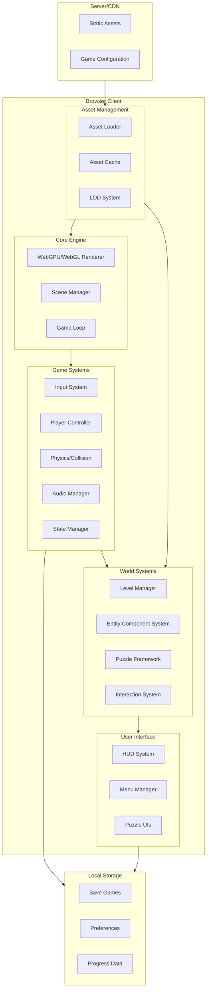
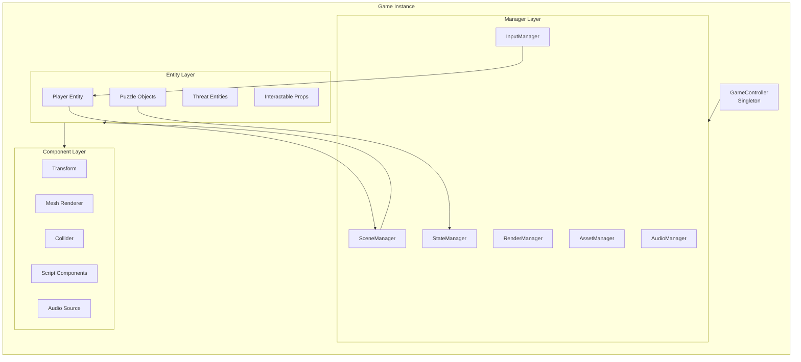
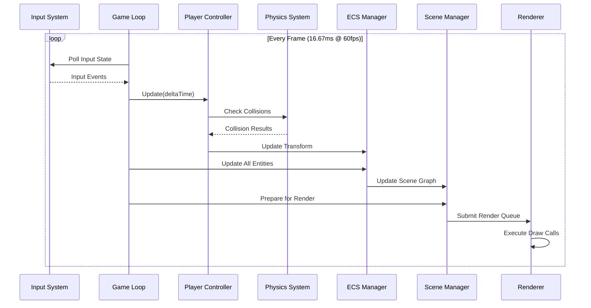
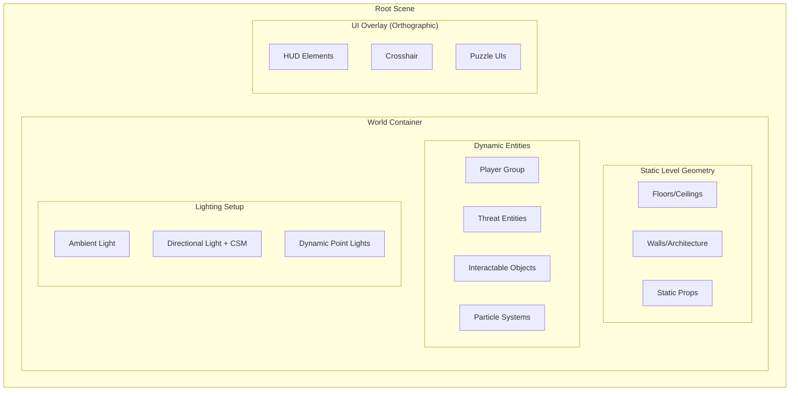

# Technical Design Document: Groucho the Hunter

> **Implementation Blueprint for a Three.js Cybersecurity Threat Hunting FPS/Adventure Game**

---

## Document Information

| Attribute | Value |
|-----------|-------|
| **Project** | Groucho the Hunter |
| **Version** | 1.0 |
| **Date** | 2026-02-01 |
| **Engine** | Three.js r171+ |
| **Target Platform** | Modern Web Browsers (WebGPU/WebGL2) |

---

## Table of Contents

1. [Architecture Overview](#1-architecture-overview)
2. [Three.js Core Setup](#2-threejs-core-setup)
3. [Game Systems Design](#3-game-systems-design)
4. [Asset Pipeline](#4-asset-pipeline)
5. [Rendering Pipeline](#5-rendering-pipeline)
6. [Puzzle Implementation Framework](#6-puzzle-implementation-framework)
7. [Level Architecture](#7-level-architecture)
8. [UI/UX Architecture](#8-uiux-architecture)
9. [Data Persistence](#9-data-persistence)
10. [Deployment Architecture](#10-deployment-architecture)
11. [File Structure](#11-file-structure)

---

## 1. Architecture Overview

### 1.1 High-Level System Architecture



### 1.2 Component Relationships



### 1.3 Data Flow Architecture



### 1.4 Technology Stack Justification

| Layer | Technology | Justification |
|-------|------------|---------------|
| **Rendering** | Three.js r171+ WebGPU/WebGL2 | Production-ready WebGPU with automatic fallback; 2-10x performance gains |
| **Physics** | three-mesh-bvh + Custom Raycasting | Optimized BVH for 80,000+ polygon collision at 60fps |
| **Audio** | Three.js Audio + Web Audio API | Native 3D spatial audio support |
| **State Management** | Custom Event-Driven System | Lightweight, game-specific implementation |
| **Build Tool** | Vite | Fast HMR, optimized builds, modern ES modules |
| **Container** | Docker + nginx | Static file serving, CDN-ready deployment |
| **Input** | Pointer Lock API + Custom Mapping | FPS-standard controls with abstraction layer |

---

## 2. Three.js Core Setup

### 2.1 Renderer Configuration

```javascript
// renderer.js - Core Renderer Setup
import * as THREE from 'three';
import { WebGPURenderer } from 'three/webgpu';

export class GameRenderer {
    constructor(container) {
        this.container = container;
        this.renderer = null;
        this.isWebGPU = false;
    }

    async initialize() {
        // Attempt WebGPU first
        try {
            this.renderer = new WebGPURenderer({
                antialias: true,
                powerPreference: "high-performance",
                alpha: false
            });
            await this.renderer.init();
            this.isWebGPU = this.renderer.isWebGPUBackend;
            console.log('WebGPU initialized:', this.isWebGPU);
        } catch (e) {
            console.warn('WebGPU failed, falling back to WebGL2');
            this.renderer = new THREE.WebGLRenderer({
                antialias: true,
                powerPreference: "high-performance"
            });
            this.isWebGPU = false;
        }

        // Configure renderer
        this.renderer.setSize(window.innerWidth, window.innerHeight);
        this.renderer.setPixelRatio(Math.min(window.devicePixelRatio, 2));
        this.renderer.shadowMap.enabled = true;
        this.renderer.shadowMap.type = THREE.PCFSoftShadowMap;
        this.renderer.outputColorSpace = THREE.SRGBColorSpace;
        this.renderer.toneMapping = THREE.ACESFilmicToneMapping;
        this.renderer.toneMappingExposure = 1.0;

        // Attach to DOM
        this.container.appendChild(this.renderer.domElement);

        // Handle resize
        window.addEventListener('resize', () => this.onResize());

        return this.renderer;
    }

    onResize() {
        const width = window.innerWidth;
        const height = window.innerHeight;
        this.renderer.setSize(width, height);
    }

    render(scene, camera) {
        this.renderer.render(scene, camera);
    }

    dispose() {
        this.renderer.dispose();
    }
}
```

### 2.2 Scene Graph Structure



### 2.3 Camera System (First-Person Perspective)

```javascript
// camera.js - FPS Camera System
import * as THREE from 'three';
import { PointerLockControls } from 'three/addons/controls/PointerLockControls.js';

export class FPSCamera {
    constructor(camera, domElement) {
        this.camera = camera;
        this.domElement = domElement;
        
        // Camera configuration
        this.camera.fov = 75;
        this.camera.near = 0.1;
        this.camera.far = 1000;
        this.camera.updateProjectionMatrix();
        
        // Controls
        this.controls = new PointerLockControls(this.camera, domElement);
        
        // Camera bob settings
        this.bobAmount = 0.05;
        this.bobFrequency = 10;
        this.bobTimer = 0;
        this.baseY = 1.7; // Eye height
        
        // Collision avoidance
        this.wallOffset = 0.3;
        this.collisionRays = [];
        this.setupCollisionRays();
    }

    setupCollisionRays() {
        // 5-ray collision detection (center, forward-left, forward-right, left, right)
        const directions = [
            new THREE.Vector3(0, 0, -1),    // Center
            new THREE.Vector3(-0.3, 0, -1), // Forward-left
            new THREE.Vector3(0.3, 0, -1),  // Forward-right
            new THREE.Vector3(-1, 0, 0),    // Left
            new THREE.Vector3(1, 0, 0)      // Right
        ];
        
        directions.forEach(dir => {
            this.collisionRays.push(new THREE.Raycaster(
                new THREE.Vector3(),
                dir.normalize(),
                0,
                this.wallOffset
            ));
        });
    }

    update(deltaTime, isMoving) {
        // Camera bob when moving
        if (isMoving) {
            this.bobTimer += deltaTime * this.bobFrequency;
            const bobOffset = Math.sin(this.bobTimer) * this.bobAmount;
            this.camera.position.y = this.baseY + bobOffset;
        } else {
            // Smooth return to base height
            this.camera.position.y = THREE.MathUtils.lerp(
                this.camera.position.y,
                this.baseY,
                deltaTime * 5
            );
        }
    }

    checkCollision(scene, movement) {
        // Cast rays to detect wall collision
        const position = this.camera.position.clone();
        
        for (const raycaster of this.collisionRays) {
            raycaster.ray.origin.copy(position);
            const intersects = raycaster.intersectObjects(scene.children, true);
            
            if (intersects.length > 0 && intersects[0].distance < this.wallOffset) {
                return true; // Collision detected
            }
        }
        return false;
    }

    lock() {
        this.controls.lock();
    }

    unlock() {
        this.controls.unlock();
    }

    get direction() {
        return this.controls.getDirection(new THREE.Vector3());
    }

    get position() {
        return this.camera.position;
    }
}
```

### 2.4 Lighting Strategy

```javascript
// lighting.js - Lighting Setup
import * as THREE from 'three';
import { CSM } from 'three/addons/csm/CSM.js';

export class LightingManager {
    constructor(scene, camera) {
        this.scene = scene;
        this.camera = camera;
        this.lights = new Map();
        this.csm = null;
    }

    initialize() {
        // Ambient light - base illumination
        const ambient = new THREE.AmbientLight(0x404040, 0.3);
        this.scene.add(ambient);
        this.lights.set('ambient', ambient);

        // Directional light (sun/main source) with CSM
        this.setupCSM();

        // Dynamic light pool (for puzzles, threats, etc.)
        this.dynamicLightPool = [];
        for (let i = 0; i < 4; i++) {
            const light = new THREE.PointLight(0xffffff, 0, 10);
            light.visible = false;
            this.scene.add(light);
            this.dynamicLightPool.push({
                light,
                inUse: false
            });
        }
    }

    setupCSM() {
        // Cascaded Shadow Maps for high-quality shadows
        this.csm = new CSM({
            maxFar: 100,
            cascades: 3,
            shadowMapSize: 2048,
            lightDirection: new THREE.Vector3(0.5, -1, 0.3).normalize(),
            camera: this.camera,
            parent: this.scene,
            shadowBias: -0.0001
        });

        this.csm.light.intensity = 1.0;
        this.csm.light.color.setHex(0xffffff);
    }

    getDynamicLight() {
        const available = this.dynamicLightPool.find(l => !l.inUse);
        if (available) {
            available.inUse = true;
            available.light.visible = true;
            return available.light;
        }
        return null; // Pool exhausted
    }

    releaseDynamicLight(light) {
        const poolItem = this.dynamicLightPool.find(l => l.light === light);
        if (poolItem) {
            poolItem.inUse = false;
            poolItem.light.visible = false;
        }
    }

    update() {
        if (this.csm) {
            this.csm.update();
        }
    }

    setLevelLighting(levelConfig) {
        // Apply level-specific lighting
        const ambient = this.lights.get('ambient');
        if (ambient && levelConfig.ambientColor) {
            ambient.color.setHex(levelConfig.ambientColor);
            ambient.intensity = levelConfig.ambientIntensity || 0.3;
        }

        if (this.csm && levelConfig.sunColor) {
            this.csm.light.color.setHex(levelConfig.sunColor);
            this.csm.light.intensity = levelConfig.sunIntensity || 1.0;
        }
    }

    dispose() {
        if (this.csm) {
            this.csm.remove();
        }
        this.lights.forEach(light => {
            this.scene.remove(light);
            if (light.dispose) light.dispose();
        });
    }
}
```

### 2.5 Performance Targets & Monitoring

```javascript
// performance.js - Performance Monitoring
export class PerformanceMonitor {
    constructor(renderer) {
        this.renderer = renderer;
        this.stats = {
            fps: 0,
            drawCalls: 0,
            triangles: 0,
            textures: 0,
            geometries: 0
        };
        this.frameCount = 0;
        this.lastTime = performance.now();
        this.targetFPS = 60;
        this.drawCallLimit = 100;
    }

    update() {
        this.frameCount++;
        const currentTime = performance.now();
        const delta = currentTime - this.lastTime;

        // Update FPS every second
        if (delta >= 1000) {
            this.stats.fps = Math.round((this.frameCount * 1000) / delta);
            this.frameCount = 0;
            this.lastTime = currentTime;

            // Get renderer info
            const info = this.renderer.info;
            this.stats.drawCalls = info.render.calls;
            this.stats.triangles = info.render.triangles;
            this.stats.textures = info.memory.textures;
            this.stats.geometries = info.memory.geometries;

            // Check performance limits
            this.checkPerformance();
        }
    }

    checkPerformance() {
        // Warn if exceeding limits
        if (this.stats.drawCalls > this.drawCallLimit) {
            console.warn(`Draw calls exceeded: ${this.stats.drawCalls}/${this.drawCallLimit}`);
        }
        if (this.stats.fps < 30) {
            console.warn(`Low FPS detected: ${this.stats.fps}`);
        }
    }

    getStats() {
        return { ...this.stats };
    }

    reset() {
        this.renderer.info.reset();
    }
}
```

---

## 3. Game Systems Design

### 3.1 Input System

```javascript
// input.js - Input Manager
export class InputManager {
    constructor() {
        this.keys = new Map();
        this.mouse = { x: 0, y: 0, deltaX: 0, deltaY: 0 };
        this.buttons = new Map();
        this.actions = new Map();
        
        // Default key bindings
        this.bindings = {
            'moveForward': ['KeyW', 'ArrowUp'],
            'moveBackward': ['KeyS', 'ArrowDown'],
            'moveLeft': ['KeyA', 'ArrowLeft'],
            'moveRight': ['KeyD', 'ArrowRight'],
            'jump': ['Space'],
            'sprint': ['ShiftLeft', 'ShiftRight'],
            'interact': ['KeyE'],
            'inventory': ['Tab'],
            'pause': ['Escape'],
            'tool1': ['Digit1'],
            'tool2': ['Digit2'],
            'tool3': ['Digit3'],
            'tool4': ['Digit4']
        };

        this.setupEventListeners();
    }

    setupEventListeners() {
        // Keyboard events
        document.addEventListener('keydown', (e) => this.onKeyDown(e));
        document.addEventListener('keyup', (e) => this.onKeyUp(e));

        // Mouse events
        document.addEventListener('mousemove', (e) => this.onMouseMove(e));
        document.addEventListener('mousedown', (e) => this.onMouseDown(e));
        document.addEventListener('mouseup', (e) => this.onMouseUp(e));

        // Prevent context menu
        document.addEventListener('contextmenu', (e) => e.preventDefault());
    }

    onKeyDown(event) {
        this.keys.set(event.code, true);
        
        // Check for action triggers
        for (const [action, keys] of Object.entries(this.bindings)) {
            if (keys.includes(event.code)) {
                this.actions.set(action, true);
            }
        }
    }

    onKeyUp(event) {
        this.keys.set(event.code, false);
        
        for (const [action, keys] of Object.entries(this.bindings)) {
            if (keys.includes(event.code)) {
                this.actions.set(action, false);
            }
        }
    }

    onMouseMove(event) {
        this.mouse.deltaX = event.movementX;
        this.mouse.deltaY = event.movementY;
        this.mouse.x = event.clientX;
        this.mouse.y = event.clientY;
    }

    onMouseDown(event) {
        this.buttons.set(event.button, true);
    }

    onMouseUp(event) {
        this.buttons.set(event.button, false);
    }

    // Public API
    isKeyPressed(code) {
        return this.keys.get(code) || false;
    }

    isActionActive(action) {
        return this.actions.get(action) || false;
    }

    isMouseDown(button) {
        return this.buttons.get(button) || false;
    }

    getMouseDelta() {
        const delta = { x: this.mouse.deltaX, y: this.mouse.deltaY };
        // Reset delta after reading
        this.mouse.deltaX = 0;
        this.mouse.deltaY = 0;
        return delta;
    }

    reset() {
        this.keys.clear();
        this.buttons.clear();
        this.actions.clear();
    }

    rebindAction(action, keys) {
        this.bindings[action] = Array.isArray(keys) ? keys : [keys];
    }
}
```

### 3.2 Player Controller

```javascript
// player.js - Player Controller
import * as THREE from 'three';

export class PlayerController {
    constructor(camera, inputManager, scene) {
        this.camera = camera;
        this.input = inputManager;
        this.scene = scene;
        
        // Movement constants
        this.speed = 5.0;
        this.sprintSpeed = 8.0;
        this.jumpForce = 8.0;
        this.gravity = 20.0;
        this.friction = 10.0;
        
        // State
        this.velocity = new THREE.Vector3();
        this.direction = new THREE.Vector3();
        this.isGrounded = false;
        this.isSprinting = false;
        this.stamina = 100;
        
        // Stamina system
        this.maxStamina = 100;
        this.staminaDrainRate = 20; // per second
        this.staminaRegenRate = 15; // per second
        this.staminaRegenDelay = 1.0; // seconds
        this.staminaTimer = 0;
    }

    update(deltaTime) {
        this.handleMovement(deltaTime);
        this.handleStamina(deltaTime);
        this.updateCamera(deltaTime);
    }

    handleMovement(deltaTime) {
        // Get input direction
        this.direction.set(0, 0, 0);
        
        if (this.input.isActionActive('moveForward')) this.direction.z -= 1;
        if (this.input.isActionActive('moveBackward')) this.direction.z += 1;
        if (this.input.isActionActive('moveLeft')) this.direction.x -= 1;
        if (this.input.isActionActive('moveRight')) this.direction.x += 1;

        // Normalize for consistent speed in all directions
        if (this.direction.length() > 0) {
            this.direction.normalize();
        }

        // Apply camera rotation to direction
        const cameraDirection = this.camera.direction;
        const cameraRight = new THREE.Vector3()
            .crossVectors(cameraDirection, new THREE.Vector3(0, 1, 0))
            .normalize();

        const moveDirection = new THREE.Vector3()
            .addScaledVector(cameraDirection, -this.direction.z)
            .addScaledVector(cameraRight, this.direction.x);
        moveDirection.y = 0;
        moveDirection.normalize();

        // Determine speed
        let targetSpeed = this.speed;
        this.isSprinting = false;
        
        if (this.input.isActionActive('sprint') && this.stamina > 0 && moveDirection.length() > 0) {
            targetSpeed = this.sprintSpeed;
            this.isSprinting = true;
            this.stamina = Math.max(0, this.stamina - this.staminaDrainRate * deltaTime);
            this.staminaTimer = 0;
        }

        // Apply acceleration
        const targetVelocity = moveDirection.multiplyScalar(targetSpeed);
        this.velocity.x = THREE.MathUtils.lerp(this.velocity.x, targetVelocity.x, this.friction * deltaTime);
        this.velocity.z = THREE.MathUtils.lerp(this.velocity.z, targetVelocity.z, this.friction * deltaTime);

        // Apply gravity
        if (!this.isGrounded) {
            this.velocity.y -= this.gravity * deltaTime;
        }

        // Jump
        if (this.input.isActionActive('jump') && this.isGrounded) {
            this.velocity.y = this.jumpForce;
            this.isGrounded = false;
        }

        // Apply movement with collision detection
        this.applyMovement(deltaTime);
    }

    applyMovement(deltaTime) {
        const movement = this.velocity.clone().multiplyScalar(deltaTime);
        
        // Check collision before applying
        if (!this.camera.checkCollision(this.scene, movement)) {
            this.camera.position.add(movement);
        } else {
            // Slide along walls
            this.velocity.multiplyScalar(0.5);
        }

        // Ground check (simplified - raycast down)
        if (this.camera.position.y <= 1.7) {
            this.camera.position.y = 1.7;
            this.velocity.y = 0;
            this.isGrounded = true;
        }
    }

    handleStamina(deltaTime) {
        if (!this.isSprinting && this.stamina < this.maxStamina) {
            this.staminaTimer += deltaTime;
            if (this.staminaTimer >= this.staminaRegenDelay) {
                this.stamina = Math.min(this.maxStamina, this.stamina + this.staminaRegenRate * deltaTime);
            }
        }
    }

    updateCamera(deltaTime) {
        const isMoving = this.velocity.length() > 0.1;
        this.camera.update(deltaTime, isMoving);
    }

    getStaminaPercent() {
        return this.stamina / this.maxStamina;
    }
}
```

### 3.3 Game State Manager

```javascript
// state-manager.js - Game State Management
export const GameStates = {
    LOADING: 'loading',
    MAIN_MENU: 'mainMenu',
    PLAYING: 'playing',
    PAUSED: 'paused',
    PUZZLE: 'puzzle',
    CUTSCENE: 'cutscene',
    GAME_OVER: 'gameOver',
    VICTORY: 'victory'
};

export class StateManager extends EventTarget {
    constructor() {
        super();
        this.currentState = GameStates.LOADING;
        this.previousState = null;
        this.stateData = new Map();
        this.stateHistory = [];
    }

    transitionTo(newState, data = null) {
        if (this.currentState === newState) return;

        this.previousState = this.currentState;
        this.stateHistory.push({
            from: this.currentState,
            to: newState,
            timestamp: Date.now()
        });

        // Store state-specific data
        if (data) {
            this.stateData.set(newState, data);
        }

        // Emit transition event
        this.dispatchEvent(new CustomEvent('stateChange', {
            detail: {
                from: this.currentState,
                to: newState,
                data
            }
        }));

        this.currentState = newState;
    }

    getCurrentState() {
        return this.currentState;
    }

    getPreviousState() {
        return this.previousState;
    }

    getStateData(state) {
        return this.stateData.get(state);
    }

    isInState(state) {
        return this.currentState === state;
    }

    canPause() {
        return this.currentState === GameStates.PLAYING ||
               this.currentState === GameStates.PUZZLE;
    }

    revertToPrevious() {
        if (this.previousState) {
            this.transitionTo(this.previousState);
        }
    }
}

// Progression System
export class ProgressionSystem {
    constructor() {
        this.experience = 0;
        this.level = 1;
        this.unlockedTools = new Set(['basicScanner']);
        this.completedPuzzles = new Set();
        this.achievements = new Map();
        
        // Level thresholds
        this.levelThresholds = [
            0,      // Level 1
            1000,   // Level 2
            3000,   // Level 3
            6000    // Level 4
        ];

        // Tool unlocks
        this.toolUnlocks = {
            1: ['basicScanner'],
            2: ['logAnalyzer', 'networkSniffer'],
            3: ['malwareDetector', 'forensicsKit'],
            4: ['advancedThreatIntel']
        };
    }

    addExperience(amount, reason = '') {
        const oldLevel = this.level;
        this.experience += amount;
        
        // Check for level up
        for (let i = this.levelThresholds.length - 1; i >= 0; i--) {
            if (this.experience >= this.levelThresholds[i]) {
                this.level = i + 1;
                break;
            }
        }

        // Unlock new tools on level up
        if (this.level > oldLevel) {
            this.onLevelUp(oldLevel, this.level);
        }

        return {
            gained: amount,
            total: this.experience,
            leveledUp: this.level > oldLevel,
            newLevel: this.level,
            reason
        };
    }

    onLevelUp(oldLevel, newLevel) {
        const newTools = this.toolUnlocks[newLevel] || [];
        newTools.forEach(tool => this.unlockedTools.add(tool));
        
        // Dispatch level up event
        window.dispatchEvent(new CustomEvent('levelUp', {
            detail: { oldLevel, newLevel, unlockedTools: newTools }
        }));
    }

    hasTool(toolId) {
        return this.unlockedTools.has(toolId);
    }

    getAvailableTools() {
        return Array.from(this.unlockedTools);
    }

    toJSON() {
        return {
            experience: this.experience,
            level: this.level,
            unlockedTools: Array.from(this.unlockedTools),
            completedPuzzles: Array.from(this.completedPuzzles),
            achievements: Object.fromEntries(this.achievements)
        };
    }

    fromJSON(data) {
        this.experience = data.experience || 0;
        this.level = data.level || 1;
        this.unlockedTools = new Set(data.unlockedTools || ['basicScanner']);
        this.completedPuzzles = new Set(data.completedPuzzles || []);
        this.achievements = new Map(Object.entries(data.achievements || {}));
    }
}
```

### 3.4 Inventory/Tool System

```javascript
// inventory.js - Tool and Inventory System
export class Tool {
    constructor(id, name, description, icon, cooldown = 0) {
        this.id = id;
        this.name = name;
        this.description = description;
        this.icon = icon;
        this.cooldown = cooldown;
        this.lastUsed = 0;
        this.isActive = false;
    }

    canUse() {
        const now = Date.now();
        return now - this.lastUsed >= this.cooldown * 1000;
    }

    use(context) {
        if (!this.canUse()) return false;
        
        this.lastUsed = Date.now();
        this.onUse(context);
        return true;
    }

    onUse(context) {
        // Override in subclasses
    }

    activate() {
        this.isActive = true;
        this.onActivate();
    }

    deactivate() {
        this.isActive = false;
        this.onDeactivate();
    }

    onActivate() {}
    onDeactivate() {}
}

export class ScannerTool extends Tool {
    constructor() {
        super('basicScanner', 'Basic Scanner', 
            'Detects threats within range', 'scanner-icon.png', 2);
        this.range = 20;
        this.scanDuration = 1.0;
    }

    onUse(context) {
        const { scene, player, onScanComplete } = context;
        
        // Perform scan
        const threats = this.scanForThreats(scene, player.position);
        
        // Visual feedback
        this.playScanEffect(player.position);
        
        // Callback with results
        if (onScanComplete) {
            setTimeout(() => onScanComplete(threats), this.scanDuration * 1000);
        }
    }

    scanForThreats(scene, position) {
        const threats = [];
        scene.traverse((object) => {
            if (object.userData.isThreat) {
                const distance = position.distanceTo(object.position);
                if (distance <= this.range) {
                    threats.push({
                        object,
                        distance,
                        type: object.userData.threatType
                    });
                }
            }
        });
        return threats;
    }

    playScanEffect(position) {
        // Create expanding ring effect
        // Implementation in visual effects system
    }
}

export class InventorySystem {
    constructor() {
        this.tools = new Map();
        this.activeTool = null;
        this.quickSlots = [null, null, null, null]; // 4 quick slots
        
        this.registerDefaultTools();
    }

    registerDefaultTools() {
        this.registerTool(new ScannerTool());
        // Additional tools registered as unlocked
    }

    registerTool(tool) {
        this.tools.set(tool.id, tool);
    }

    unlockTool(toolId) {
        // Tool factory would create appropriate instance
        const tool = this.createTool(toolId);
        if (tool) {
            this.registerTool(tool);
            this.assignToQuickSlot(toolId);
        }
    }

    createTool(toolId) {
        // Factory pattern for tool creation
        const toolFactories = {
            'basicScanner': () => new ScannerTool(),
            'logAnalyzer': () => new LogAnalyzerTool(),
            'networkSniffer': () => new NetworkSnifferTool(),
            'malwareDetector': () => new MalwareDetectorTool(),
            'forensicsKit': () => new ForensicsKitTool()
        };

        const factory = toolFactories[toolId];
        return factory ? factory() : null;
    }

    assignToQuickSlot(toolId, slot = -1) {
        if (slot === -1) {
            // Find first empty slot
            slot = this.quickSlots.findIndex(s => s === null);
            if (slot === -1) return false; // No empty slots
        }

        this.quickSlots[slot] = toolId;
        return true;
    }

    setActiveTool(toolId) {
        if (this.activeTool) {
            const current = this.tools.get(this.activeTool);
            if (current) current.deactivate();
        }

        this.activeTool = toolId;
        const tool = this.tools.get(toolId);
        if (tool) tool.activate();

        // Dispatch tool change event
        window.dispatchEvent(new CustomEvent('toolChanged', {
            detail: { toolId, tool }
        }));
    }

    useActiveTool(context) {
        if (!this.activeTool) return false;
        const tool = this.tools.get(this.activeTool);
        return tool ? tool.use(context) : false;
    }

    getQuickSlotTool(slot) {
        const toolId = this.quickSlots[slot];
        return toolId ? this.tools.get(toolId) : null;
    }

    getAllTools() {
        return Array.from(this.tools.values());
    }

    getUnlockedTools() {
        return this.getAllTools(); // All registered tools are unlocked
    }
}
```

### 3.5 Audio System

```javascript
// audio.js - Audio Management System
import * as THREE from 'three';

export class AudioManager {
    constructor(camera) {
        this.camera = camera;
        this.listener = new THREE.AudioListener();
        this.camera.add(this.listener);
        
        this.audioLoader = new THREE.AudioLoader();
        this.soundCache = new Map();
        this.activeSounds = new Set();
        
        // Background music
        this.currentMusic = null;
        this.musicVolume = 0.5;
        this.sfxVolume = 0.7;
        
        // Spatial audio pool
        this.spatialAudioPool = [];
        this.maxSpatialSounds = 16;
    }

    async loadSound(url, id) {
        if (this.soundCache.has(id)) {
            return this.soundCache.get(id);
        }

        return new Promise((resolve, reject) => {
            this.audioLoader.load(url, (buffer) => {
                this.soundCache.set(id, buffer);
                resolve(buffer);
            }, undefined, reject);
        });
    }

    playSound(soundId, options = {}) {
        const buffer = this.soundCache.get(soundId);
        if (!buffer) {
            console.warn(`Sound not found: ${soundId}`);
            return null;
        }

        const sound = new THREE.Audio(this.listener);
        sound.setBuffer(buffer);
        sound.setVolume(options.volume || this.sfxVolume);
        sound.setLoop(options.loop || false);
        
        if (options.detune) {
            sound.detune = options.detune;
        }

        sound.play();
        this.activeSounds.add(sound);

        // Auto-remove when done
        sound.onEnded = () => {
            this.activeSounds.delete(sound);
        };

        return sound;
    }

    playSpatialSound(soundId, position, options = {}) {
        const buffer = this.soundCache.get(soundId);
        if (!buffer) return null;

        // Check if we should play based on distance
        const distance = this.camera.position.distanceTo(position);
        const maxDistance = options.maxDistance || 50;
        
        if (distance > maxDistance) return null;

        // Get or create spatial audio
        const sound = this.getSpatialAudio();
        if (!sound) return null; // Pool exhausted

        sound.setBuffer(buffer);
        sound.setRefDistance(options.refDistance || 10);
        sound.setMaxDistance(maxDistance);
        sound.setRolloffFactor(options.rolloffFactor || 1);
        sound.setVolume(options.volume || this.sfxVolume);
        sound.setLoop(options.loop || false);

        // Attach to a temporary object at position
        const soundObject = new THREE.Object3D();
        soundObject.position.copy(position);
        soundObject.add(sound);

        sound.play();
        
        // Return control object
        return {
            sound,
            object: soundObject,
            stop: () => {
                sound.stop();
                this.releaseSpatialAudio(sound);
            },
            updatePosition: (newPosition) => {
                soundObject.position.copy(newPosition);
            }
        };
    }

    getSpatialAudio() {
        // Find available spatial audio from pool or create new if under limit
        for (const item of this.spatialAudioPool) {
            if (!item.inUse) {
                item.inUse = true;
                return item.sound;
            }
        }

        if (this.spatialAudioPool.length < this.maxSpatialSounds) {
            const sound = new THREE.PositionalAudio(this.listener);
            this.spatialAudioPool.push({ sound, inUse: true });
            return sound;
        }

        return null;
    }

    releaseSpatialAudio(sound) {
        const item = this.spatialAudioPool.find(i => i.sound === sound);
        if (item) {
            item.inUse = false;
        }
    }

    playMusic(musicId, fadeDuration = 2000) {
        const buffer = this.soundCache.get(musicId);
        if (!buffer) return;

        // Fade out current music
        if (this.currentMusic) {
            this.fadeOut(this.currentMusic, fadeDuration, () => {
                this.currentMusic = null;
            });
        }

        // Create new music track
        const music = new THREE.Audio(this.listener);
        music.setBuffer(buffer);
        music.setVolume(0);
        music.setLoop(true);
        music.play();
        
        this.currentMusic = music;
        
        // Fade in
        this.fadeIn(music, this.musicVolume, fadeDuration);
    }

    fadeIn(sound, targetVolume, duration) {
        const startTime = Date.now();
        const startVolume = sound.getVolume();
        
        const fade = () => {
            const elapsed = Date.now() - startTime;
            const progress = Math.min(elapsed / duration, 1);
            const volume = startVolume + (targetVolume - startVolume) * progress;
            sound.setVolume(volume);
            
            if (progress < 1) {
                requestAnimationFrame(fade);
            }
        };
        
        fade();
    }

    fadeOut(sound, duration, callback) {
        const startTime = Date.now();
        const startVolume = sound.getVolume();
        
        const fade = () => {
            const elapsed = Date.now() - startTime;
            const progress = Math.min(elapsed / duration, 1);
            const volume = startVolume * (1 - progress);
            sound.setVolume(volume);
            
            if (progress < 1) {
                requestAnimationFrame(fade);
            } else {
                sound.stop();
                if (callback) callback();
            }
        };
        
        fade();
    }

    setMusicVolume(volume) {
        this.musicVolume = Math.max(0, Math.min(1, volume));
        if (this.currentMusic) {
            this.currentMusic.setVolume(this.musicVolume);
        }
    }

    setSfxVolume(volume) {
        this.sfxVolume = Math.max(0, Math.min(1, volume));
    }

    stopAllSounds() {
        this.activeSounds.forEach(sound => sound.stop());
        this.activeSounds.clear();
        
        if (this.currentMusic) {
            this.currentMusic.stop();
            this.currentMusic = null;
        }
    }

    dispose() {
        this.stopAllSounds();
        this.soundCache.clear();
    }
}
```

---

## 4. Asset Pipeline

### 4.1 3D Model Formats

| Format | Use Case | Compression | Notes |
|--------|----------|-------------|-------|
| **GLB** | Runtime models | Draco (90-95% reduction) | Single file, embedded textures |
| **GLTF** | Source/Development | None | Separate files for editing |
| **GLB+Draco** | Production | Draco + KTX2 | Optimal for web delivery |

```javascript
// asset-loader.js - Asset Loading Pipeline
import { GLTFLoader } from 'three/addons/loaders/GLTFLoader.js';
import { DRACOLoader } from 'three/addons/loaders/DRACOLoader.js';
import { KTX2Loader } from 'three/addons/loaders/KTX2Loader.js';

export class AssetLoader {
    constructor(renderer) {
        this.loadingManager = new THREE.LoadingManager();
        this.setupLoaders(renderer);
        
        this.cache = new Map();
        this.loadingQueue = new Map();
    }

    setupLoaders(renderer) {
        // GLTF/GLB Loader with Draco
        this.gltfLoader = new GLTFLoader(this.loadingManager);
        
        const dracoLoader = new DRACOLoader();
        dracoLoader.setDecoderPath('/assets/draco/');
        this.gltfLoader.setDRACOLoader(dracoLoader);

        // KTX2 Loader for texture compression
        if (renderer) {
            const ktx2Loader = new KTX2Loader();
            ktx2Loader.setTranscoderPath('/assets/basis/');
            ktx2Loader.detectSupport(renderer);
            this.gltfLoader.setKTX2Loader(ktx2Loader);
        }
    }

    async loadModel(url, id) {
        // Check cache
        if (this.cache.has(id)) {
            return this.cache.get(id).clone();
        }

        // Check if already loading
        if (this.loadingQueue.has(id)) {
            return this.loadingQueue.get(id);
        }

        // Create loading promise
        const loadPromise = new Promise((resolve, reject) => {
            this.gltfLoader.load(url, (gltf) => {
                // Optimize model
                const optimized = this.optimizeModel(gltf);
                this.cache.set(id, optimized);
                this.loadingQueue.delete(id);
                resolve(optimized);
            }, undefined, reject);
        });

        this.loadingQueue.set(id, loadPromise);
        return loadPromise;
    }

    optimizeModel(gltf) {
        const scene = gltf.scene;
        
        scene.traverse((child) => {
            if (child.isMesh) {
                // Enable frustum culling
                child.frustumCulled = true;
                
                // Optimize materials
                if (child.material) {
                    // Share materials where possible
                    child.material.precision = 'highp';
                }
                
                // Generate LOD if not present
                if (!child.userData.lod) {
                    child.userData.lod = this.calculateLOD(child);
                }
            }
        });

        return scene;
    }

    calculateLOD(mesh) {
        // Simple LOD calculation based on bounding box size
        const box = new THREE.Box3().setFromObject(mesh);
        const size = box.getSize(new THREE.Vector3());
        const maxDimension = Math.max(size.x, size.y, size.z);
        
        return {
            high: 0,
            medium: maxDimension * 2,
            low: maxDimension * 5,
            hide: maxDimension * 10
        };
    }

    async loadTexture(url, id, options = {}) {
        if (this.cache.has(id)) {
            return this.cache.get(id);
        }

        const loader = new THREE.TextureLoader(this.loadingManager);
        const texture = await loader.loadAsync(url);
        
        // Configure texture
        texture.colorSpace = options.colorSpace || THREE.SRGBColorSpace;
        texture.minFilter = options.minFilter || THREE.LinearMipmapLinearFilter;
        texture.magFilter = options.magFilter || THREE.LinearFilter;
        texture.wrapS = options.wrapS || THREE.RepeatWrapping;
        texture.wrapT = options.wrapT || THREE.RepeatWrapping;
        texture.anisotropy = options.anisotropy || 4;
        
        // Generate mipmaps if not already
        if (!texture.mipmaps && texture.generateMipmaps) {
            texture.needsUpdate = true;
        }

        this.cache.set(id, texture);
        return texture;
    }

    getFromCache(id) {
        const asset = this.cache.get(id);
        return asset ? (asset.clone ? asset.clone() : asset) : null;
    }

    preloadAssets(assetList) {
        const promises = assetList.map(asset => {
            switch (asset.type) {
                case 'model':
                    return this.loadModel(asset.url, asset.id);
                case 'texture':
                    return this.loadTexture(asset.url, asset.id, asset.options);
                case 'audio':
                    return this.loadAudio(asset.url, asset.id);
                default:
                    return Promise.resolve();
            }
        });

        return Promise.all(promises);
    }

    dispose(id) {
        const asset = this.cache.get(id);
        if (asset) {
            if (asset.dispose) asset.dispose();
            this.cache.delete(id);
        }
    }

    disposeAll() {
        this.cache.forEach((asset) => {
            if (asset.dispose) asset.dispose();
        });
        this.cache.clear();
    }
}
```

### 4.2 Texture Formats

| Format | Quality | VRAM Usage | Best For |
|--------|---------|------------|----------|
| **KTX2 UASTC** | High | ~4x PNG | Normal maps, hero textures, UI |
| **KTX2 ETC1S** | Medium | ~6x PNG | Environment maps, secondary assets |
| **WebP** | High | ~2x PNG | Fallback, legacy support |
| **PNG** | Lossless | Baseline | Source assets only |

### 4.3 Audio Formats

| Format | Use Case | Compression | Notes |
|--------|----------|-------------|-------|
| **OGG Vorbis** | SFX, Music | High | Best compression, open source |
| **MP3** | Music | Medium | Universal support |
| **WAV** | Short SFX | None | UI sounds, immediate playback |
| **Opus** | Voice, Ambient | Very High | Future consideration |

### 4.4 Asset Loading Strategy

```javascript
// loading-strategy.js - Progressive Loading
export class LoadingStrategy {
    constructor(assetLoader) {
        this.loader = assetLoader;
        this.loadStages = {
            CRITICAL: 0,   // Must load before game starts
            LEVEL: 1,      // Load with level
            BACKGROUND: 2, // Load during gameplay
            ON_DEMAND: 3   // Load when needed
        };
        this.activeLoads = new Map();
    }

    async loadLevel(levelId, onProgress) {
        const levelData = await this.fetchLevelData(levelId);
        
        // Stage 1: Critical assets
        onProgress?.({ stage: 'Loading core assets...', percent: 0 });
        await this.loadCriticalAssets(levelData.critical);
        
        // Stage 2: Level geometry
        onProgress?.({ stage: 'Building world...', percent: 33 });
        await this.loadLevelAssets(levelData.assets);
        
        // Stage 3: Background assets (async)
        onProgress?.({ stage: 'Preparing additional content...', percent: 66 });
        this.loadBackgroundAssets(levelData.background);
        
        onProgress?.({ stage: 'Ready!', percent: 100 });
        return levelData;
    }

    async loadCriticalAssets(assets) {
        return this.loader.preloadAssets(assets);
    }

    loadBackgroundAssets(assets) {
        // Load with low priority, allowing gameplay to start
        requestIdleCallback(() => {
            this.loader.preloadAssets(assets);
        });
    }

    // LOD System
    updateLOD(camera, scene) {
        const frustum = new THREE.Frustum();
        const projScreenMatrix = new THREE.Matrix4();
        
        camera.updateMatrixWorld();
        projScreenMatrix.multiplyMatrices(
            camera.projectionMatrix,
            camera.matrixWorldInverse
        );
        frustum.setFromProjectionMatrix(projScreenMatrix);

        scene.traverse((object) => {
            if (object.userData.lod && object.isMesh) {
                const distance = camera.position.distanceTo(object.position);
                const lod = object.userData.lod;
                
                if (distance > lod.hide) {
                    object.visible = false;
                } else if (distance > lod.low) {
                    object.visible = true;
                    // Switch to low poly version
                    this.setLODLevel(object, 'low');
                } else if (distance > lod.medium) {
                    object.visible = true;
                    this.setLODLevel(object, 'medium');
                } else {
                    object.visible = true;
                    this.setLODLevel(object, 'high');
                }
                
                // Frustum culling optimization
                if (!frustum.intersectsObject(object)) {
                    object.visible = false;
                }
            }
        });
    }

    setLODLevel(object, level) {
        if (object.userData.currentLOD === level) return;
        
        // Swap geometry/material based on LOD
        const lodData = object.userData.lodMeshes;
        if (lodData && lodData[level]) {
            object.geometry = lodData[level].geometry;
            object.material = lodData[level].material;
            object.userData.currentLOD = level;
        }
    }
}
```

---

## 5. Rendering Pipeline

### 5.1 Shadow Mapping (Cascaded Shadow Maps)

```javascript
// shadows.js - Shadow Configuration
export class ShadowSystem {
    constructor(renderer, scene, camera) {
        this.renderer = renderer;
        this.scene = scene;
        this.camera = camera;
        
        // CSM Configuration
        this.csmConfig = {
            maxFar: 100,
            cascades: 3,
            shadowMapSize: 2048,
            shadowBias: -0.0001,
            lightMargin: 200,
            shadowNormalBias: 0.02
        };
    }

    initialize() {
        // CSM is initialized in LightingManager
        // This class handles shadow-specific optimizations
        
        // Optimize shadow rendering
        this.renderer.shadowMap.enabled = true;
        this.renderer.shadowMap.type = THREE.PCFSoftShadowMap;
        
        // Disable auto-update for static scenes
        this.renderer.shadowMap.autoUpdate = false;
        this.renderer.shadowMap.needsUpdate = true;
    }

    markShadowsDirty() {
        this.renderer.shadowMap.needsUpdate = true;
    }

    optimizeShadowCasters() {
        // Only enable shadows for objects close to camera
        const cameraPos = this.camera.position;
        
        this.scene.traverse((object) => {
            if (object.isMesh && object.castShadow) {
                const distance = cameraPos.distanceTo(object.position);
                // Disable shadows for distant objects
                object.castShadow = distance < 50;
            }
        });
    }
}
```

### 5.2 Post-Processing Effects

```javascript
// postprocessing.js - Post Processing Pipeline
import { EffectComposer } from 'three/addons/postprocessing/EffectComposer.js';
import { RenderPass } from 'three/addons/postprocessing/RenderPass.js';
import { UnrealBloomPass } from 'three/addons/postprocessing/UnrealBloomPass.js';
import { OutputPass } from 'three/addons/postprocessing/OutputPass.js';

export class PostProcessing {
    constructor(renderer, scene, camera) {
        this.renderer = renderer;
        this.scene = scene;
        this.camera = camera;
        
        this.composer = new EffectComposer(renderer);
        this.setupPasses();
    }

    setupPasses() {
        // Render pass
        const renderPass = new RenderPass(this.scene, this.camera);
        this.composer.addPass(renderPass);

        // Bloom for glowing cyber effects
        const bloomPass = new UnrealBloomPass(
            new THREE.Vector2(window.innerWidth, window.innerHeight),
            0.5,  // strength
            0.4,  // radius
            0.85  // threshold
        );
        this.composer.addPass(bloomPass);
        this.bloomPass = bloomPass;

        // Output pass (color space conversion)
        const outputPass = new OutputPass();
        this.composer.addPass(outputPass);
    }

    setBloomStrength(strength) {
        this.bloomPass.strength = strength;
    }

    setBloomThreshold(threshold) {
        this.bloomPass.threshold = threshold;
    }

    render() {
        this.composer.render();
    }

    onResize(width, height) {
        this.composer.setSize(width, height);
    }
}
```

### 5.3 Level of Detail (LOD) System

See [Asset Loading Strategy](#44-asset-loading-strategy) for LOD implementation.

### 5.4 Occlusion Culling

```javascript
// occlusion.js - Occlusion Culling
export class OcclusionCulling {
    constructor(scene, camera) {
        this.scene = scene;
        this.camera = camera;
        this.occluders = [];
        this.occludees = [];
        this.boundingBoxes = new Map();
    }

    registerOccluder(object) {
        if (!object.isMesh) return;
        this.occluders.push(object);
        this.updateBoundingBox(object);
    }

    registerOccludee(object) {
        if (!object.isMesh) return;
        this.occludees.push(object);
        this.updateBoundingBox(object);
    }

    updateBoundingBox(object) {
        const box = new THREE.Box3().setFromObject(object);
        this.boundingBoxes.set(object.uuid, box);
    }

    update() {
        const frustum = new THREE.Frustum();
        const projScreenMatrix = new THREE.Matrix4();
        
        this.camera.updateMatrixWorld();
        projScreenMatrix.multiplyMatrices(
            this.camera.projectionMatrix,
            this.camera.matrixWorldInverse
        );
        frustum.setFromProjectionMatrix(projScreenMatrix);

        // Simple frustum culling first
        this.occludees.forEach(object => {
            const box = this.boundingBoxes.get(object.uuid);
            if (box) {
                object.visible = frustum.intersectsBox(box);
            }
        });

        // Note: Full occlusion culling requires hardware support
        // or depth buffer readback which is expensive in WebGL
        // For this project, frustum culling + LOD is sufficient
    }
}
```

### 5.5 Particle Systems

```javascript
// particles.js - Particle System
export class ParticleSystem {
    constructor(scene, maxParticles = 10000) {
        this.scene = scene;
        this.maxParticles = maxParticles;
        this.particles = [];
        this.geometry = new THREE.BufferGeometry();
        
        // Initialize buffers
        this.positions = new Float32Array(maxParticles * 3);
        this.colors = new Float32Array(maxParticles * 3);
        this.sizes = new Float32Array(maxParticles);
        this.lifetimes = new Float32Array(maxParticles);
        
        this.geometry.setAttribute('position', new THREE.BufferAttribute(this.positions, 3));
        this.geometry.setAttribute('color', new THREE.BufferAttribute(this.colors, 3));
        this.geometry.setAttribute('size', new THREE.BufferAttribute(this.sizes, 1));
        
        // Shader material for custom particles
        this.material = new THREE.ShaderMaterial({
            uniforms: {
                pointTexture: { value: new THREE.TextureLoader().load('/assets/particles/spark.png') }
            },
            vertexShader: this.getVertexShader(),
            fragmentShader: this.getFragmentShader(),
            blending: THREE.AdditiveBlending,
            depthWrite: false,
            transparent: true
        });

        this.mesh = new THREE.Points(this.geometry, this.material);
        this.mesh.frustumCulled = false;
        scene.add(this.mesh);
        
        this.activeCount = 0;
    }

    emit(config) {
        const count = config.count || 1;
        
        for (let i = 0; i < count && this.activeCount < this.maxParticles; i++) {
            const index = this.activeCount;
            
            // Position
            this.positions[index * 3] = config.position.x + (Math.random() - 0.5) * config.spread;
            this.positions[index * 3 + 1] = config.position.y + (Math.random() - 0.5) * config.spread;
            this.positions[index * 3 + 2] = config.position.z + (Math.random() - 0.5) * config.spread;
            
            // Color
            this.colors[index * 3] = config.color.r;
            this.colors[index * 3 + 1] = config.color.g;
            this.colors[index * 3 + 2] = config.color.b;
            
            // Size
            this.sizes[index] = config.size || 1;
            
            // Lifetime
            this.lifetimes[index] = config.lifetime || 1;
            
            // Store particle data
            this.particles[index] = {
                velocity: config.velocity || new THREE.Vector3(),
                acceleration: config.acceleration || new THREE.Vector3(),
                initialLifetime: config.lifetime || 1,
                drag: config.drag || 0.98
            };
            
            this.activeCount++;
        }
        
        this.geometry.attributes.position.needsUpdate = true;
        this.geometry.attributes.color.needsUpdate = true;
        this.geometry.attributes.size.needsUpdate = true;
    }

    update(deltaTime) {
        for (let i = this.activeCount - 1; i >= 0; i--) {
            const particle = this.particles[i];
            
            // Update lifetime
            this.lifetimes[i] -= deltaTime;
            
            if (this.lifetimes[i] <= 0) {
                // Remove particle by swapping with last active
                this.swapParticles(i, this.activeCount - 1);
                this.activeCount--;
                continue;
            }
            
            // Update physics
            particle.velocity.addScaledVector(particle.acceleration, deltaTime);
            particle.velocity.multiplyScalar(particle.drag);
            
            // Update position
            this.positions[i * 3] += particle.velocity.x * deltaTime;
            this.positions[i * 3 + 1] += particle.velocity.y * deltaTime;
            this.positions[i * 3 + 2] += particle.velocity.z * deltaTime;
            
            // Fade size based on lifetime
            const lifePercent = this.lifetimes[i] / particle.initialLifetime;
            this.sizes[i] *= 0.99;
        }
        
        this.geometry.setDrawRange(0, this.activeCount);
        this.geometry.attributes.position.needsUpdate = true;
        this.geometry.attributes.size.needsUpdate = true;
    }

    swapParticles(a, b) {
        // Swap position
        for (let i = 0; i < 3; i++) {
            const temp = this.positions[a * 3 + i];
            this.positions[a * 3 + i] = this.positions[b * 3 + i];
            this.positions[b * 3 + i] = temp;
        }
        
        // Swap color
        for (let i = 0; i < 3; i++) {
            const temp = this.colors[a * 3 + i];
            this.colors[a * 3 + i] = this.colors[b * 3 + i];
            this.colors[b * 3 + i] = temp;
        }
        
        // Swap size and lifetime
        const tempSize = this.sizes[a];
        this.sizes[a] = this.sizes[b];
        this.sizes[b] = tempSize;
        
        const tempLife = this.lifetimes[a];
        this.lifetimes[a] = this.lifetimes[b];
        this.lifetimes[b] = tempLife;
        
        // Swap particle data
        const tempParticle = this.particles[a];
        this.particles[a] = this.particles[b];
        this.particles[b] = tempParticle;
    }

    getVertexShader() {
        return `
            attribute float size;
            varying vec3 vColor;
            
            void main() {
                vColor = color;
                vec4 mvPosition = modelViewMatrix * vec4(position, 1.0);
                gl_PointSize = size * (300.0 / -mvPosition.z);
                gl_Position = projectionMatrix * mvPosition;
            }
        `;
    }

    getFragmentShader() {
        return `
            uniform sampler2D pointTexture;
            varying vec3 vColor;
            
            void main() {
                gl_FragColor = vec4(vColor, 1.0) * texture2D(pointTexture, gl_PointCoord);
                if (gl_FragColor.a < 0.1) discard;
            }
        `;
    }

    dispose() {
        this.geometry.dispose();
        this.material.dispose();
        this.scene.remove(this.mesh);
    }
}
```

---

## 6. Puzzle Implementation Framework

### 6.1 Base Puzzle Class Architecture

```javascript
// puzzle-base.js - Base Puzzle Class
export class PuzzleBase extends EventTarget {
    constructor(id, config) {
        super();
        this.id = id;
        this.config = {
            title: 'Puzzle',
            description: '',
            timeLimit: 0, // 0 = no limit
            maxAttempts: 0,
            difficulty: 1,
            ...config
        };
        
        this.state = 'idle'; // idle, active, completed, failed
        this.attempts = 0;
        this.startTime = 0;
        this.endTime = 0;
        this.data = null;
        this.solution = null;
    }

    // Lifecycle methods
    initialize(data) {
        this.data = data;
        this.state = 'idle';
        this.attempts = 0;
        this.onInitialize();
        return this;
    }

    start() {
        if (this.state !== 'idle') return false;
        
        this.state = 'active';
        this.startTime = Date.now();
        this.onStart();
        
        this.dispatchEvent(new CustomEvent('started', { 
            detail: { puzzleId: this.id } 
        }));
        
        return true;
    }

    submitAttempt(solution) {
        if (this.state !== 'active') return false;
        
        this.attempts++;
        const isCorrect = this.validateSolution(solution);
        
        if (isCorrect) {
            this.complete();
        } else if (this.config.maxAttempts > 0 && 
                   this.attempts >= this.config.maxAttempts) {
            this.fail('max_attempts');
        } else {
            this.onIncorrectAttempt(solution);
            this.dispatchEvent(new CustomEvent('attemptFailed', {
                detail: { attempt: this.attempts, maxAttempts: this.config.maxAttempts }
            }));
        }
        
        return isCorrect;
    }

    complete() {
        this.state = 'completed';
        this.endTime = Date.now();
        this.onComplete();
        
        this.dispatchEvent(new CustomEvent('completed', {
            detail: {
                puzzleId: this.id,
                timeTaken: this.endTime - this.startTime,
                attempts: this.attempts
            }
        }));
    }

    fail(reason) {
        this.state = 'failed';
        this.endTime = Date.now();
        this.onFail(reason);
        
        this.dispatchEvent(new CustomEvent('failed', {
            detail: { puzzleId: this.id, reason }
        }));
    }

    abort() {
        if (this.state === 'active') {
            this.state = 'idle';
            this.onAbort();
        }
    }

    getTimeRemaining() {
        if (this.config.timeLimit === 0) return Infinity;
        if (this.state !== 'active') return 0;
        
        const elapsed = Date.now() - this.startTime;
        return Math.max(0, this.config.timeLimit * 1000 - elapsed);
    }

    getProgress() {
        return {
            state: this.state,
            attempts: this.attempts,
            maxAttempts: this.config.maxAttempts,
            timeRemaining: this.getTimeRemaining(),
            timeLimit: this.config.timeLimit
        };
    }

    // Override in subclasses
    onInitialize() {}
    onStart() {}
    validateSolution(solution) { return false; }
    onIncorrectAttempt(solution) {}
    onComplete() {}
    onFail(reason) {}
    onAbort() {}

    // Cleanup
    dispose() {
        this.abort();
        this.data = null;
        this.solution = null;
    }
}

// Puzzle Manager
export class PuzzleManager {
    constructor() {
        this.puzzles = new Map();
        this.activePuzzle = null;
        this.completedPuzzles = new Set();
        this.registry = new Map();
    }

    registerPuzzleType(type, PuzzleClass) {
        this.registry.set(type, PuzzleClass);
    }

    createPuzzle(type, id, config, data) {
        const PuzzleClass = this.registry.get(type);
        if (!PuzzleClass) {
            throw new Error(`Unknown puzzle type: ${type}`);
        }

        const puzzle = new PuzzleClass(id, config);
        puzzle.initialize(data);
        this.puzzles.set(id, puzzle);
        
        // Event forwarding
        puzzle.addEventListener('completed', (e) => this.onPuzzleCompleted(e));
        puzzle.addEventListener('failed', (e) => this.onPuzzleFailed(e));
        
        return puzzle;
    }

    startPuzzle(id) {
        const puzzle = this.puzzles.get(id);
        if (!puzzle) return false;

        if (this.activePuzzle) {
            this.activePuzzle.abort();
        }

        this.activePuzzle = puzzle;
        return puzzle.start();
    }

    submitSolution(solution) {
        if (!this.activePuzzle) return false;
        return this.activePuzzle.submitAttempt(solution);
    }

    abortCurrentPuzzle() {
        if (this.activePuzzle) {
            this.activePuzzle.abort();
            this.activePuzzle = null;
        }
    }

    onPuzzleCompleted(event) {
        this.completedPuzzles.add(event.detail.puzzleId);
        this.activePuzzle = null;
        
        // Dispatch global event
        window.dispatchEvent(new CustomEvent('puzzleCompleted', {
            detail: event.detail
        }));
    }

    onPuzzleFailed(event) {
        this.activePuzzle = null;
        
        window.dispatchEvent(new CustomEvent('puzzleFailed', {
            detail: event.detail
        }));
    }

    hasCompleted(puzzleId) {
        return this.completedPuzzles.has(puzzleId);
    }

    getCompletedCount() {
        return this.completedPuzzles.size;
    }

    dispose() {
        this.puzzles.forEach(puzzle => puzzle.dispose());
        this.puzzles.clear();
        this.completedPuzzles.clear();
        this.activePuzzle = null;
    }
}
```

### 6.2 Log Analysis Terminal

```javascript
// puzzle-log-analysis.js - Log Analysis Puzzle
import { PuzzleBase } from './puzzle-base.js';

export class LogAnalysisPuzzle extends PuzzleBase {
    constructor(id, config) {
        super(id, {
            title: 'Log Analysis',
            description: 'Analyze system logs to identify attack patterns',
            ...config
        });
        
        this.logs = [];
        this.attackSignatures = [];
        this.identificationTasks = [];
    }

    onInitialize() {
        // Parse log data
        this.logs = this.generateLogs(this.data);
        this.attackSignatures = this.data.signatures || [];
        this.identificationTasks = this.data.tasks || [];
    }

    generateLogs(data) {
        // Generate realistic log entries with embedded attack patterns
        const logs = [];
        const baseTime = Date.now() - 86400000; // 24 hours ago
        
        data.events.forEach((event, index) => {
            logs.push({
                id: index,
                timestamp: baseTime + event.timeOffset,
                severity: event.severity,
                source: event.source,
                message: event.message,
                isThreat: event.isThreat || false,
                threatType: event.threatType || null
            });
        });
        
        return logs.sort((a, b) => a.timestamp - b.timestamp);
    }

    validateSolution(solution) {
        // Solution format: { identifiedThreats: [{ logId, threatType }] }
        if (!solution || !solution.identifiedThreats) return false;
        
        const threats = solution.identifiedThreats;
        
        // Check if all real threats are identified
        const realThreats = this.logs.filter(log => log.isThreat);
        
        if (threats.length !== realThreats.length) return false;
        
        // Verify each identified threat
        return threats.every(threat => {
            const log = this.logs.find(l => l.id === threat.logId);
            return log && log.isThreat && log.threatType === threat.threatType;
        });
    }

    getLogData() {
        // Return logs without exposing threat flags
        return this.logs.map(log => ({
            id: log.id,
            timestamp: log.timestamp,
            severity: log.severity,
            source: log.source,
            message: log.message
        }));
    }

    getHints() {
        const hints = [];
        const threatCount = this.logs.filter(l => l.isThreat).length;
        
        hints.push(`Look for ${threatCount} suspicious entries in the logs.`);
        hints.push('Pay attention to failed authentication attempts.');
        hints.push('Check for unusual data access patterns.');
        
        return hints;
    }
}
```

### 6.3 Network Forensics Visualizer

```javascript
// puzzle-network-forensics.js - Network Forensics Puzzle
import { PuzzleBase } from './puzzle-base.js';

export class NetworkForensicsPuzzle extends PuzzleBase {
    constructor(id, config) {
        super(id, {
            title: 'Network Forensics',
            description: 'Trace suspicious network traffic to identify C2 channels',
            ...config
        });
        
        this.nodes = [];
        this.connections = [];
        this.packets = [];
        this.c2Nodes = [];
    }

    onInitialize() {
        this.nodes = this.data.nodes.map(n => ({
            id: n.id,
            type: n.type, // 'internal', 'external', 'suspicious'
            ip: n.ip,
            label: n.label,
            x: n.x,
            y: n.y,
            isC2: n.isC2 || false
        }));
        
        this.connections = this.data.connections;
        this.packets = this.data.packets;
        this.c2Nodes = this.nodes.filter(n => n.isC2).map(n => n.id);
    }

    validateSolution(solution) {
        // Solution format: { suspectedC2Nodes: [nodeId1, nodeId2] }
        if (!solution || !solution.suspectedC2Nodes) return false;
        
        const suspected = solution.suspectedC2Nodes.sort();
        const actual = this.c2Nodes.sort();
        
        return JSON.stringify(suspected) === JSON.stringify(actual);
    }

    getNetworkData() {
        return {
            nodes: this.nodes.map(n => ({
                id: n.id,
                type: n.type,
                ip: n.ip,
                label: n.label,
                x: n.x,
                y: n.y
                // Note: isC2 is not exposed
            })),
            connections: this.connections,
            packets: this.packets.map(p => ({
                id: p.id,
                source: p.source,
                destination: p.destination,
                protocol: p.protocol,
                size: p.size,
                timestamp: p.timestamp
            }))
        };
    }

    analyzeTraffic(nodeId, timeRange) {
        // Return traffic statistics for a node
        const relevantPackets = this.packets.filter(p => 
            (p.source === nodeId || p.destination === nodeId) &&
            p.timestamp >= timeRange.start &&
            p.timestamp <= timeRange.end
        );
        
        return {
            totalPackets: relevantPackets.length,
            totalBytes: relevantPackets.reduce((sum, p) => sum + p.size, 0),
            uniqueConnections: new Set(relevantPackets.map(p => 
                p.source === nodeId ? p.destination : p.source
            )).size,
            protocols: this.countProtocols(relevantPackets)
        };
    }

    countProtocols(packets) {
        const counts = {};
        packets.forEach(p => {
            counts[p.protocol] = (counts[p.protocol] || 0) + 1;
        });
        return counts;
    }
}
```

### 6.4 Malware Signature Matcher

```javascript
// puzzle-malware-matcher.js - Malware Signature Matching
import { PuzzleBase } from './puzzle-base.js';

export class MalwareSignaturePuzzle extends PuzzleBase {
    constructor(id, config) {
        super(id, {
            title: 'Malware Signature Analysis',
            description: 'Match suspicious code patterns to known malware signatures',
            ...config
        });
        
        this.samples = [];
        this.signatures = [];
        this.matches = [];
    }

    onInitialize() {
        this.samples = this.data.samples.map((s, index) => ({
            id: index,
            name: s.name,
            code: s.code,
            type: s.type,
            signatureId: s.signatureId
        }));
        
        this.signatures = this.data.signatures;
        
        // Calculate correct matches
        this.matches = this.samples.map(s => ({
            sampleId: s.id,
            signatureId: s.signatureId
        }));
    }

    validateSolution(solution) {
        // Solution format: { matches: [{ sampleId, signatureId }] }
        if (!solution || !solution.matches) return false;
        
        const submitted = solution.matches.sort((a, b) => 
            a.sampleId - b.sampleId || a.signatureId - b.signatureId
        );
        
        const expected = this.matches.sort((a, b) => 
            a.sampleId - b.sampleId || a.signatureId - b.signatureId
        );
        
        return JSON.stringify(submitted) === JSON.stringify(expected);
    }

    getSamples() {
        return this.samples.map(s => ({
            id: s.id,
            name: s.name,
            code: s.code,
            type: s.type
        }));
    }

    getSignatures() {
        return this.signatures;
    }

    getBehaviorHints() {
        return {
            'trojan': 'Disguises as legitimate software, creates backdoors',
            'ransomware': 'Encrypts files, demands payment',
            'spyware': 'Collects sensitive information secretly',
            'worm': 'Self-replicates across network',
            'rootkit': 'Hides deep in system, difficult to detect'
        };
    }
}
```

### 6.5 Anomaly Detection Scanner

```javascript
// puzzle-anomaly-detection.js - Anomaly Detection Puzzle
import { PuzzleBase } from './puzzle-base.js';

export class AnomalyDetectionPuzzle extends PuzzleBase {
    constructor(id, config) {
        super(id, {
            title: 'Anomaly Detection',
            description: 'Identify unusual patterns in system behavior',
            ...config
        });
        
        this.baselineData = [];
        this.currentData = [];
        this.anomalies = [];
    }

    onInitialize() {
        this.baselineData = this.data.baseline;
        this.currentData = this.data.current;
        this.anomalies = this.data.anomalies;
    }

    validateSolution(solution) {
        // Solution format: { detectedAnomalies: [{ index, type, confidence }] }
        if (!solution || !solution.detectedAnomalies) return false;
        
        const detected = solution.detectedAnomalies
            .filter(a => a.confidence >= 0.7) // Minimum confidence threshold
            .map(a => a.index)
            .sort();
        
        const actual = this.anomalies.map(a => a.index).sort();
        
        // Require at least 80% of anomalies detected
        const correct = detected.filter(d => actual.includes(d)).length;
        const precision = correct / detected.length;
        const recall = correct / actual.length;
        
        return precision >= 0.8 && recall >= 0.8;
    }

    getBaselineStats() {
        return this.calculateStats(this.baselineData);
    }

    getCurrentData() {
        return this.currentData;
    }

    calculateStats(data) {
        const values = data.map(d => d.value);
        const mean = values.reduce((a, b) => a + b, 0) / values.length;
        const variance = values.reduce((sum, val) => 
            sum + Math.pow(val - mean, 2), 0) / values.length;
        
        return {
            mean,
            stdDev: Math.sqrt(variance),
            min: Math.min(...values),
            max: Math.max(...values),
            median: this.calculateMedian(values)
        };
    }

    calculateMedian(values) {
        const sorted = [...values].sort((a, b) => a - b);
        const mid = Math.floor(sorted.length / 2);
        return sorted.length % 2 ? sorted[mid] : (sorted[mid - 1] + sorted[mid]) / 2;
    }

    getAnomalyTypes() {
        return [
            { id: 'spike', name: 'Traffic Spike', description: 'Sudden increase in activity' },
            { id: 'drop', name: 'Activity Drop', description: 'Unusual decrease in activity' },
            { id: 'pattern', name: 'Pattern Change', description: 'Different behavior pattern' },
            { id: 'timing', name: 'Timing Anomaly', description: 'Activity at unusual time' }
        ];
    }
}
```

### 6.6 Incident Response Console

```javascript
// puzzle-incident-response.js - Incident Response Puzzle
import { PuzzleBase } from './puzzle-base.js';

export class IncidentResponsePuzzle extends PuzzleBase {
    constructor(id, config) {
        super(id, {
            title: 'Incident Response',
            description: 'Coordinate containment, eradication, and recovery',
            ...config
        });
        
        this.incident = null;
        this.systems = [];
        this.availableActions = [];
        this.correctSequence = [];
    }

    onInitialize() {
        this.incident = this.data.incident;
        this.systems = this.data.systems;
        this.availableActions = this.data.actions;
        this.correctSequence = this.data.correctSequence;
    }

    validateSolution(solution) {
        // Solution format: { actions: [{ actionId, targetId, timing }] }
        if (!solution || !solution.actions) return false;
        
        const submitted = solution.actions;
        
        // Check if sequence matches (allowing for some flexibility in timing)
        if (submitted.length !== this.correctSequence.length) return false;
        
        return submitted.every((action, index) => {
            const expected = this.correctSequence[index];
            return action.actionId === expected.actionId &&
                   action.targetId === expected.targetId;
        });
    }

    simulateAction(actionId, targetId) {
        const action = this.availableActions.find(a => a.id === actionId);
        const system = this.systems.find(s => s.id === targetId);
        
        if (!action || !system) {
            return { success: false, error: 'Invalid action or target' };
        }

        // Simulate action effects
        const result = {
            success: true,
            actionId,
            targetId,
            effects: [],
            newSystemState: { ...system }
        };

        // Apply action effects
        switch (action.type) {
            case 'isolate':
                result.newSystemState.isolated = true;
                result.effects.push(`${system.name} has been isolated from network`);
                break;
            case 'quarantine':
                result.newSystemState.quarantined = true;
                result.effects.push(`Threat on ${system.name} has been quarantined`);
                break;
            case 'restore':
                result.newSystemState.infected = false;
                result.effects.push(`${system.name} has been restored from backup`);
                break;
            case 'patch':
                result.newSystemState.patched = true;
                result.effects.push(`Vulnerability on ${system.name} has been patched`);
                break;
        }

        return result;
    }

    getIncidentReport() {
        return {
            id: this.incident.id,
            severity: this.incident.severity,
            description: this.incident.description,
            affectedSystems: this.incident.affectedSystems,
            indicators: this.incident.indicators
        };
    }

    getSystems() {
        return this.systems;
    }

    getAvailableActions() {
        return this.availableActions;
    }

    getNISTPhases() {
        return [
            { id: 'contain', name: 'Containment', description: 'Prevent spread' },
            { id: 'eradicate', name: 'Eradication', description: 'Remove threat' },
            { id: 'recover', name: 'Recovery', description: 'Restore systems' }
        ];
    }
}
```

---

## 7. Level Architecture

### 7.1 Level Data Format (JSON Schema)

```json
{
  "schemaVersion": "1.0",
  "level": {
    "id": "level_1_outskirts",
    "name": "The Outskirts of Network Town",
    "description": "Introduction to threat hunting",
    "xpRange": [0, 1000],
    "estimatedTime": 45,
    
    "environment": {
      "skybox": "textures/sky/day",
      "ambientColor": "#404040",
      "ambientIntensity": 0.3,
      "sunColor": "#ffffff",
      "sunIntensity": 1.0,
      "sunDirection": [0.5, -1, 0.3],
      "fog": {
        "enabled": true,
        "color": "#ccddff",
        "near": 50,
        "far": 200
      }
    },
    
    "geometry": {
      "staticMesh": "models/level1/geometry.glb",
      "collisionMesh": "models/level1/collision.glb",
      "lightmap": "textures/level1/lightmap.ktx2"
    },
    
    "entities": [
      {
        "id": "player_start",
        "type": "PlayerSpawn",
        "position": [0, 1.7, 0],
        "rotation": [0, 0, 0]
      },
      {
        "id": "phishing_email_1",
        "type": "ThreatEntity",
        "threatType": "phishing",
        "position": [10, 1, 15],
        "model": "models/threats/phisher.glb",
        "behavior": "patrol",
        "patrolPath": [[10, 1, 15], [15, 1, 15], [15, 1, 20], [10, 1, 20]]
      },
      {
        "id": "puzzle_terminal_1",
        "type": "PuzzleInteractable",
        "puzzleType": "LogAnalysis",
        "puzzleId": "level1_logs",
        "position": [5, 1, 10],
        "model": "models/props/terminal.glb",
        "interactionPrompt": "Analyze Logs [E]"
      },
      {
        "id": "trigger_intro",
        "type": "Trigger",
        "shape": "box",
        "bounds": [[-5, 0, -5], [5, 5, 5]],
        "onEnter": "start_intro_cutscene",
        "once": true
      }
    ],
    
    "puzzles": [
      {
        "id": "level1_logs",
        "type": "LogAnalysis",
        "config": {
          "title": "Suspicious Login Attempts",
          "difficulty": 1,
          "timeLimit": 300
        },
        "data": {
          "events": [
            {
              "timeOffset": 0,
              "severity": "info",
              "source": "auth-service",
              "message": "User admin login successful from 192.168.1.100",
              "isThreat": false
            },
            {
              "timeOffset": 60000,
              "severity": "warning",
              "source": "auth-service",
              "message": "Failed login attempt for user admin from 10.0.0.50",
              "isThreat": true,
              "threatType": "brute_force"
            }
          ],
          "signatures": ["brute_force", "unusual_access_time"]
        }
      }
    ],
    
    "audio": {
      "ambient": "audio/ambient/cyber_western.ogg",
      "music": "audio/music/level1_theme.ogg",
      "footsteps": "audio/sfx/footsteps_metal"
    },
    
    "objectives": [
      {
        "id": "obj_1",
        "description": "Investigate the perimeter",
        "type": "exploration",
        "target": "trigger_outskirts"
      },
      {
        "id": "obj_2",
        "description": "Analyze suspicious logs",
        "type": "puzzle",
        "target": "level1_logs"
      }
    ],
    
    "spawners": {
      "threats": [
        {
          "type": "phishing",
          "maxActive": 3,
          "spawnPoints": ["spawn_1", "spawn_2", "spawn_3"],
          "respawnDelay": 30
        }
      ]
    }
  }
}
```

### 7.2 Entity Component System (ECS) Design

```javascript
// ecs.js - Entity Component System
export class Entity {
    constructor(id) {
        this.id = id;
        this.components = new Map();
        this.tags = new Set();
        this.active = true;
    }

    addComponent(component) {
        const type = component.constructor.name;
        this.components.set(type, component);
        component.entity = this;
        return this;
    }

    getComponent(ComponentClass) {
        return this.components.get(ComponentClass.name);
    }

    hasComponent(ComponentClass) {
        return this.components.has(ComponentClass.name);
    }

    removeComponent(ComponentClass) {
        const component = this.components.get(ComponentClass.name);
        if (component) {
            component.dispose?.();
            this.components.delete(ComponentClass.name);
        }
        return this;
    }

    addTag(tag) {
        this.tags.add(tag);
        return this;
    }

    hasTag(tag) {
        return this.tags.has(tag);
    }

    destroy() {
        this.components.forEach(component => {
            component.dispose?.();
        });
        this.components.clear();
        this.active = false;
    }
}

// Components
export class TransformComponent {
    constructor(position = [0, 0, 0], rotation = [0, 0, 0], scale = [1, 1, 1]) {
        this.position = new THREE.Vector3(...position);
        this.rotation = new THREE.Euler(...rotation);
        this.scale = new THREE.Vector3(...scale);
        this.matrix = new THREE.Matrix4();
        this.matrixWorld = new THREE.Matrix4();
    }

    updateMatrix() {
        this.matrix.compose(
            this.position,
            new THREE.Quaternion().setFromEuler(this.rotation),
            this.scale
        );
    }
}

export class MeshComponent {
    constructor(geometry, material) {
        this.geometry = geometry;
        this.material = material;
        this.mesh = new THREE.Mesh(geometry, material);
        this.visible = true;
        this.castShadow = true;
        this.receiveShadow = true;
    }

    setVisibility(visible) {
        this.visible = visible;
        this.mesh.visible = visible;
    }

    dispose() {
        this.geometry?.dispose();
        this.material?.dispose();
    }
}

export class ColliderComponent {
    constructor(type = 'box', params = {}) {
        this.type = type;
        this.params = params;
        this.isTrigger = false;
        this.bounds = new THREE.Box3();
    }

    updateBounds(transform) {
        // Calculate world-space bounds
        if (this.type === 'box') {
            const size = new THREE.Vector3(...(this.params.size || [1, 1, 1]));
            const halfSize = size.multiplyScalar(0.5);
            this.bounds.min.copy(transform.position).sub(halfSize);
            this.bounds.max.copy(transform.position).add(halfSize);
        }
    }

    intersects(other) {
        return this.bounds.intersectsBox(other.bounds);
    }
}

export class ScriptComponent {
    constructor(scriptClass, ...args) {
        this.script = new scriptClass(...args);
        this.script.component = this;
    }

    update(deltaTime) {
        this.script.update?.(deltaTime);
    }

    onCollisionEnter(other) {
        this.script.onCollisionEnter?.(other);
    }

    dispose() {
        this.script.dispose?.();
    }
}

// ECS Manager
export class ECSManager {
    constructor(scene) {
        this.scene = scene;
        this.entities = new Map();
        this.systems = [];
        this.componentPools = new Map();
    }

    createEntity(id) {
        const entity = new Entity(id);
        this.entities.set(id, entity);
        return entity;
    }

    getEntity(id) {
        return this.entities.get(id);
    }

    removeEntity(id) {
        const entity = this.entities.get(id);
        if (entity) {
            entity.destroy();
            this.entities.delete(id);
        }
    }

    addSystem(system) {
        this.systems.push(system);
        system.ecs = this;
        return this;
    }

    update(deltaTime) {
        // Update all systems
        this.systems.forEach(system => {
            system.update(deltaTime, this.entities);
        });
    }

    queryComponents(...componentTypes) {
        const results = [];
        this.entities.forEach(entity => {
            if (entity.active && componentTypes.every(type => entity.hasComponent(type))) {
                results.push(entity);
            }
        });
        return results;
    }

    queryByTag(tag) {
        const results = [];
        this.entities.forEach(entity => {
            if (entity.active && entity.hasTag(tag)) {
                results.push(entity);
            }
        });
        return results;
    }
}

// Example Systems
export class MovementSystem {
    update(deltaTime, entities) {
        entities.forEach(entity => {
            const transform = entity.getComponent(TransformComponent);
            if (!transform) return;

            // Update transform matrix
            transform.updateMatrix();

            // Sync with mesh if present
            const mesh = entity.getComponent(MeshComponent);
            if (mesh) {
                mesh.mesh.position.copy(transform.position);
                mesh.mesh.rotation.copy(transform.rotation);
                mesh.mesh.scale.copy(transform.scale);
            }
        });
    }
}

export class CollisionSystem {
    update(deltaTime, entities) {
        const colliders = [];
        
        // Collect all colliders
        entities.forEach(entity => {
            const collider = entity.getComponent(ColliderComponent);
            const transform = entity.getComponent(TransformComponent);
            if (collider && transform) {
                collider.updateBounds(transform);
                colliders.push({ entity, collider });
            }
        });

        // Check collisions
        for (let i = 0; i < colliders.length; i++) {
            for (let j = i + 1; j < colliders.length; j++) {
                const a = colliders[i];
                const b = colliders[j];

                if (a.collider.intersects(b.collider)) {
                    // Notify scripts
                    const scriptA = a.entity.getComponent(ScriptComponent);
                    const scriptB = b.entity.getComponent(ScriptComponent);
                    
                    scriptA?.onCollisionEnter(b.entity);
                    scriptB?.onCollisionEnter(a.entity);
                }
            }
        }
    }
}
```

### 7.3 Trigger System

```javascript
// trigger-system.js - Trigger System
export class TriggerSystem {
    constructor(ecsManager, eventBus) {
        this.ecs = ecsManager;
        this.eventBus = eventBus;
        this.triggers = [];
        this.triggered = new Set();
    }

    createTrigger(config) {
        const trigger = {
            id: config.id,
            bounds: config.bounds,
            shape: config.shape || 'box',
            onEnter: config.onEnter,
            onExit: config.onExit,
            onStay: config.onStay,
            once: config.once || false,
            filter: config.filter || null, // Entity filter function
            active: true
        };

        this.triggers.push(trigger);
        return trigger;
    }

    update() {
        const playerEntity = this.ecs.queryByTag('player')[0];
        if (!playerEntity) return;

        const playerTransform = playerEntity.getComponent(TransformComponent);
        if (!playerTransform) return;

        const playerPos = playerTransform.position;

        this.triggers.forEach(trigger => {
            if (!trigger.active) return;

            const wasInside = this.triggered.has(trigger.id);
            const isInside = this.checkIntersection(trigger, playerPos);

            if (isInside && !wasInside) {
                // Enter
                this.onTriggerEnter(trigger, playerEntity);
                this.triggered.add(trigger.id);
                
                if (trigger.once) {
                    trigger.active = false;
                }
            } else if (!isInside && wasInside) {
                // Exit
                this.onTriggerExit(trigger, playerEntity);
                this.triggered.delete(trigger.id);
            } else if (isInside && wasInside && trigger.onStay) {
                // Stay
                this.executeCallback(trigger.onStay, trigger, playerEntity);
            }
        });
    }

    checkIntersection(trigger, point) {
        if (trigger.shape === 'box') {
            const [min, max] = trigger.bounds;
            return point.x >= min[0] && point.x <= max[0] &&
                   point.y >= min[1] && point.y <= max[1] &&
                   point.z >= min[2] && point.z <= max[2];
        } else if (trigger.shape === 'sphere') {
            const [center, radius] = trigger.bounds;
            const centerVec = new THREE.Vector3(...center);
            return point.distanceTo(centerVec) <= radius;
        }
        return false;
    }

    onTriggerEnter(trigger, entity) {
        if (trigger.onEnter) {
            this.executeCallback(trigger.onEnter, trigger, entity);
        }

        this.eventBus.emit('triggerEnter', {
            triggerId: trigger.id,
            entity
        });
    }

    onTriggerExit(trigger, entity) {
        if (trigger.onExit) {
            this.executeCallback(trigger.onExit, trigger, entity);
        }

        this.eventBus.emit('triggerExit', {
            triggerId: trigger.id,
            entity
        });
    }

    executeCallback(callback, trigger, entity) {
        if (typeof callback === 'string') {
            // Named event
            this.eventBus.emit(callback, { trigger, entity });
        } else if (typeof callback === 'function') {
            // Direct function
            callback(trigger, entity);
        }
    }

    resetTrigger(triggerId) {
        const trigger = this.triggers.find(t => t.id === triggerId);
        if (trigger) {
            trigger.active = true;
            this.triggered.delete(triggerId);
        }
    }

    disableTrigger(triggerId) {
        const trigger = this.triggers.find(t => t.id === triggerId);
        if (trigger) {
            trigger.active = false;
        }
    }

    removeTrigger(triggerId) {
        this.triggers = this.triggers.filter(t => t.id !== triggerId);
        this.triggered.delete(triggerId);
    }
}
```

### 7.4 Spawn/Despawn Management

```javascript
// spawn-manager.js - Spawn Management
export class SpawnManager {
    constructor(ecsManager, assetLoader) {
        this.ecs = ecsManager;
        this.assetLoader = assetLoader;
        this.spawners = new Map();
        this.activeEntities = new Map();
        this.despawnQueue = [];
    }

    registerSpawner(config) {
        this.spawners.set(config.id, {
            ...config,
            lastSpawnTime: 0,
            activeCount: 0
        });
    }

    update(deltaTime) {
        // Process spawners
        this.spawners.forEach((spawner, id) => {
            this.updateSpawner(spawner, id);
        });

        // Process despawns
        this.processDespawns();
    }

    updateSpawner(spawner, id) {
        // Check if we need to spawn
        if (spawner.activeCount >= spawner.maxActive) return;

        const now = Date.now();
        const timeSinceLastSpawn = now - spawner.lastSpawnTime;

        if (timeSinceLastSpawn < spawner.respawnDelay * 1000) return;

        // Check spawn conditions
        if (spawner.condition && !spawner.condition()) return;

        // Spawn entity
        this.spawnEntity(spawner, id);
    }

    spawnEntity(spawner, spawnerId) {
        const spawnPoint = this.selectSpawnPoint(spawner);
        if (!spawnPoint) return;

        // Create entity based on type
        const entity = this.createEntityFromType(spawner.type, spawnPoint);
        
        if (entity) {
            spawner.activeCount++;
            spawner.lastSpawnTime = Date.now();
            
            // Track entity
            if (!this.activeEntities.has(spawnerId)) {
                this.activeEntities.set(spawnerId, new Set());
            }
            this.activeEntities.get(spawnerId).add(entity.id);

            // Listen for entity destruction
            entity.onDestroy = () => {
                this.onEntityDestroyed(spawnerId, entity.id);
            };
        }
    }

    selectSpawnPoint(spawner) {
        const availablePoints = spawner.spawnPoints.filter(point => {
            // Check if point is not occupied
            return !this.isSpawnPointOccupied(point);
        });

        if (availablePoints.length === 0) return null;

        // Random selection or use priority system
        return availablePoints[Math.floor(Math.random() * availablePoints.length)];
    }

    isSpawnPointOccupied(point) {
        // Check if any active entity is too close to this point
        this.activeEntities.forEach(entities => {
            entities.forEach(entityId => {
                const entity = this.ecs.getEntity(entityId);
                if (entity) {
                    const transform = entity.getComponent(TransformComponent);
                    if (transform) {
                        const distance = transform.position.distanceTo(new THREE.Vector3(...point));
                        if (distance < 5) return true;
                    }
                }
            });
        });
        return false;
    }

    createEntityFromType(type, spawnPoint) {
        const id = `${type}_${Date.now()}_${Math.random().toString(36).substr(2, 9)}`;
        const entity = this.ecs.createEntity(id);

        // Add transform
        entity.addComponent(new TransformComponent(spawnPoint));

        // Add type-specific components
        switch (type) {
            case 'phishing':
                this.setupPhishingThreat(entity);
                break;
            case 'malware':
                this.setupMalwareThreat(entity);
                break;
            case 'apt':
                this.setupAPTThreat(entity);
                break;
        }

        return entity;
    }

    setupPhishingThreat(entity) {
        entity.addTag('threat');
        entity.addTag('phishing');
        
        // Add mesh (placeholder - would load actual model)
        const geometry = new THREE.BoxGeometry(1, 1, 1);
        const material = new THREE.MeshStandardMaterial({ color: 0xff6600 });
        entity.addComponent(new MeshComponent(geometry, material));

        // Add AI/Behavior script
        entity.addComponent(new ScriptComponent(ThreatBehavior, 'patrol'));

        // Setup threat data
        entity.threatData = {
            type: 'phishing',
            difficulty: 1,
            xpReward: 25
        };
    }

    setupMalwareThreat(entity) {
        entity.addTag('threat');
        entity.addTag('malware');
        
        const geometry = new THREE.BoxGeometry(1.5, 1.5, 1.5);
        const material = new THREE.MeshStandardMaterial({ color: 0xff0000 });
        entity.addComponent(new MeshComponent(geometry, material));

        entity.addComponent(new ScriptComponent(ThreatBehavior, 'aggressive'));

        entity.threatData = {
            type: 'malware',
            difficulty: 2,
            xpReward: 50
        };
    }

    setupAPTThreat(entity) {
        entity.addTag('threat');
        entity.addTag('apt');
        
        const geometry = new THREE.BoxGeometry(2, 2, 2);
        const material = new THREE.MeshStandardMaterial({ color: 0x6600ff });
        entity.addComponent(new MeshComponent(geometry, material));

        entity.addComponent(new ScriptComponent(ThreatBehavior, 'stealth'));

        entity.threatData = {
            type: 'apt',
            difficulty: 4,
            xpReward: 200
        };
    }

    onEntityDestroyed(spawnerId, entityId) {
        const entities = this.activeEntities.get(spawnerId);
        if (entities) {
            entities.delete(entityId);
        }

        const spawner = this.spawners.get(spawnerId);
        if (spawner) {
            spawner.activeCount = Math.max(0, spawner.activeCount - 1);
        }
    }

    despawnEntity(entityId) {
        this.despawnQueue.push(entityId);
    }

    processDespawns() {
        while (this.despawnQueue.length > 0) {
            const entityId = this.despawnQueue.shift();
            
            // Find and remove from active tracking
            this.activeEntities.forEach((entities, spawnerId) => {
                if (entities.has(entityId)) {
                    entities.delete(entityId);
                    const spawner = this.spawners.get(spawnerId);
                    if (spawner) {
                        spawner.activeCount--;
                    }
                }
            });

            // Remove from ECS
            this.ecs.removeEntity(entityId);
        }
    }

    getActiveEntityCount(spawnerId) {
        const entities = this.activeEntities.get(spawnerId);
        return entities ? entities.size : 0;
    }

    despawnAll() {
        this.activeEntities.forEach((entities) => {
            entities.forEach(entityId => {
                this.despawnQueue.push(entityId);
            });
        });
        this.processDespawns();
    }
}

// Threat Behavior Script
class ThreatBehavior {
    constructor(behaviorType) {
        this.type = behaviorType;
        this.state = 'idle';
        this.target = null;
        this.patrolIndex = 0;
        this.patrolPath = [];
    }

    update(deltaTime) {
        const transform = this.component.entity.getComponent(TransformComponent);
        if (!transform) return;

        switch (this.type) {
            case 'patrol':
                this.updatePatrol(deltaTime, transform);
                break;
            case 'aggressive':
                this.updateAggressive(deltaTime, transform);
                break;
            case 'stealth':
                this.updateStealth(deltaTime, transform);
                break;
        }
    }

    updatePatrol(deltaTime, transform) {
        // Simple patrol behavior
        if (this.patrolPath.length === 0) return;

        const targetPoint = this.patrolPath[this.patrolIndex];
        const target = new THREE.Vector3(...targetPoint);
        const direction = target.clone().sub(transform.position).normalize();
        
        const speed = 2;
        transform.position.addScaledVector(direction, speed * deltaTime);

        if (transform.position.distanceTo(target) < 0.5) {
            this.patrolIndex = (this.patrolIndex + 1) % this.patrolPath.length;
        }
    }

    updateAggressive(deltaTime, transform) {
        // Move toward player if detected
        // Simplified - would use actual player detection
    }

    updateStealth(deltaTime, transform) {
        // Hide, occasionally move
        // Simplified - would use actual stealth logic
    }

    onCollisionEnter(other) {
        if (other.hasTag('player')) {
            // Trigger combat or interaction
        }
    }

    dispose() {
        // Cleanup
    }
}
```

---

## 8. UI/UX Architecture

### 8.1 HUD Design

```javascript
// hud.js - Heads-Up Display
export class HUDSystem {
    constructor(container) {
        this.container = container;
        this.elements = new Map();
        this.visible = true;
        
        this.createHUD();
    }

    createHUD() {
        // Main HUD container
        this.hudContainer = document.createElement('div');
        this.hudContainer.className = 'game-hud';
        this.hudContainer.innerHTML = `
            <div class="hud-top">
                <div class="hud-health">
                    <div class="health-bar">
                        <div class="health-fill" style="width: 100%"></div>
                    </div>
                    <span class="health-text">100/100</span>
                </div>
                <div class="hud-xp">
                    <div class="xp-bar">
                        <div class="xp-fill" style="width: 0%"></div>
                    </div>
                    <span class="xp-text">Level 1</span>
                </div>
            </div>
            
            <div class="hud-center">
                <div class="crosshair"></div>
                <div class="interaction-prompt"></div>
            </div>
            
            <div class="hud-bottom">
                <div class="hud-tools">
                    <div class="tool-slot" data-slot="0"></div>
                    <div class="tool-slot" data-slot="1"></div>
                    <div class="tool-slot" data-slot="2"></div>
                    <div class="tool-slot" data-slot="3"></div>
                </div>
                <div class="hud-threat-meter">
                    <div class="threat-indicator"></div>
                </div>
                <div class="hud-stamina">
                    <div class="stamina-bar">
                        <div class="stamina-fill" style="width: 100%"></div>
                    </div>
                </div>
            </div>
            
            <div class="hud-objectives">
                <h3>Objectives</h3>
                <ul class="objective-list"></ul>
            </div>
            
            <div class="hud-notifications"></div>
        `;
        
        this.container.appendChild(this.hudContainer);
        
        // Cache element references
        this.elements.set('healthFill', this.hudContainer.querySelector('.health-fill'));
        this.elements.set('healthText', this.hudContainer.querySelector('.health-text'));
        this.elements.set('xpFill', this.hudContainer.querySelector('.xp-fill'));
        this.elements.set('xpText', this.hudContainer.querySelector('.xp-text'));
        this.elements.set('crosshair', this.hudContainer.querySelector('.crosshair'));
        this.elements.set('interactionPrompt', this.hudContainer.querySelector('.interaction-prompt'));
        this.elements.set('staminaFill', this.hudContainer.querySelector('.stamina-fill'));
        this.elements.set('objectiveList', this.hudContainer.querySelector('.objective-list'));
        this.elements.set('notifications', this.hudContainer.querySelector('.hud-notifications'));
        
        // Tool slots
        for (let i = 0; i < 4; i++) {
            this.elements.set(`toolSlot${i}`, this.hudContainer.querySelector(`.tool-slot[data-slot="${i}"]`));
        }
    }

    // Health
    setHealth(current, max) {
        const percent = (current / max) * 100;
        this.elements.get('healthFill').style.width = `${percent}%`;
        this.elements.get('healthText').textContent = `${current}/${max}`;
    }

    // XP and Level
    setXP(current, max, level) {
        const percent = (current / max) * 100;
        this.elements.get('xpFill').style.width = `${percent}%`;
        this.elements.get('xpText').textContent = `Level ${level}`;
    }

    // Stamina
    setStamina(percent) {
        this.elements.get('staminaFill').style.width = `${percent * 100}%`;
    }

    // Tools
    setTool(slot, toolData) {
        const slotElement = this.elements.get(`toolSlot${slot}`);
        if (toolData) {
            slotElement.innerHTML = `
                
                <span class="tool-key">${slot + 1}</span>
            `;
            slotElement.classList.add('has-tool');
        } else {
            slotElement.innerHTML = '';
            slotElement.classList.remove('has-tool');
        }
    }

    setActiveTool(slot) {
        for (let i = 0; i < 4; i++) {
            const slotElement = this.elements.get(`toolSlot${i}`);
            slotElement.classList.toggle('active', i === slot);
        }
    }

    // Interaction
    showInteractionPrompt(text) {
        this.elements.get('interactionPrompt').textContent = text;
        this.elements.get('interactionPrompt').classList.add('visible');
    }

    hideInteractionPrompt() {
        this.elements.get('interactionPrompt').classList.remove('visible');
    }

    // Crosshair
    setCrosshairState(state) {
        const crosshair = this.elements.get('crosshair');
        crosshair.className = `crosshair ${state}`;
    }

    // Objectives
    setObjectives(objectives) {
        const list = this.elements.get('objectiveList');
        list.innerHTML = objectives.map(obj => `
            <li class="objective ${obj.completed ? 'completed' : ''}">
                <span class="objective-marker">${obj.completed ? '✓' : '○'}</span>
                <span class="objective-text">${obj.description}</span>
            </li>
        `).join('');
    }

    // Notifications
    showNotification(message, type = 'info', duration = 3000) {
        const container = this.elements.get('notifications');
        const notification = document.createElement('div');
        notification.className = `notification ${type}`;
        notification.textContent = message;
        
        container.appendChild(notification);
        
        // Animate in
        requestAnimationFrame(() => {
            notification.classList.add('visible');
        });
        
        // Remove after duration
        setTimeout(() => {
            notification.classList.remove('visible');
            setTimeout(() => notification.remove(), 300);
        }, duration);
    }

    // Visibility
    show() {
        this.hudContainer.classList.remove('hidden');
        this.visible = true;
    }

    hide() {
        this.hudContainer.classList.add('hidden');
        this.visible = false;
    }

    toggle() {
        this.visible ? this.hide() : this.show();
    }
}
```

### 8.2 Menu System Structure

```javascript
// menu-system.js - Menu Management
export class MenuSystem {
    constructor(container) {
        this.container = container;
        this.menus = new Map();
        this.menuStack = [];
        this.currentMenu = null;
    }

    registerMenu(id, menu) {
        menu.id = id;
        menu.system = this;
        this.menus.set(id, menu);
    }

    openMenu(menuId, data = null) {
        const menu = this.menus.get(menuId);
        if (!menu) return false;

        // Close current menu if any
        if (this.currentMenu) {
            this.currentMenu.hide();
            this.menuStack.push(this.currentMenu.id);
        }

        this.currentMenu = menu;
        menu.show(data);
        
        return true;
    }

    closeMenu() {
        if (!this.currentMenu) return false;

        this.currentMenu.hide();
        
        // Return to previous menu
        if (this.menuStack.length > 0) {
            const previousId = this.menuStack.pop();
            this.currentMenu = this.menus.get(previousId);
            this.currentMenu.show();
        } else {
            this.currentMenu = null;
        }
        
        return true;
    }

    closeAllMenus() {
        this.menus.forEach(menu => menu.hide());
        this.menuStack = [];
        this.currentMenu = null;
    }

    isMenuOpen(menuId) {
        return this.currentMenu?.id === menuId;
    }
}

// Base Menu Class
export class MenuBase {
    constructor(template) {
        this.id = null;
        this.system = null;
        this.visible = false;
        this.element = null;
        this.template = template;
        this.eventListeners = [];
    }

    show(data = null) {
        if (!this.element) {
            this.createElement();
        }

        this.onShow(data);
        this.element.classList.add('visible');
        this.visible = true;
    }

    hide() {
        if (this.element) {
            this.element.classList.remove('visible');
        }
        this.onHide();
        this.visible = false;
    }

    createElement() {
        this.element = document.createElement('div');
        this.element.className = 'game-menu';
        this.element.innerHTML = this.template;
        this.system.container.appendChild(this.element);
        this.bindEvents();
    }

    bindEvents() {
        // Override in subclasses
    }

    onShow(data) {
        // Override in subclasses
    }

    onHide() {
        // Override in subclasses
    }

    close() {
        this.system.closeMenu();
    }

    dispose() {
        this.hide();
        this.eventListeners.forEach(({ element, event, handler }) => {
            element.removeEventListener(event, handler);
        });
        this.element?.remove();
    }
}

// Main Menu
export class MainMenu extends MenuBase {
    constructor() {
        super(`
            <div class="menu-content main-menu">
                <h1>Groucho the Hunter</h1>
                <nav class="menu-nav">
                    <button class="menu-btn" data-action="newGame">New Game</button>
                    <button class="menu-btn" data-action="continue">Continue</button>
                    <button class="menu-btn" data-action="settings">Settings</button>
                    <button class="menu-btn" data-action="credits">Credits</button>
                </nav>
            </div>
        `);
    }

    bindEvents() {
        const buttons = this.element.querySelectorAll('[data-action]');
        buttons.forEach(btn => {
            const handler = () => this.handleAction(btn.dataset.action);
            btn.addEventListener('click', handler);
            this.eventListeners.push({ element: btn, event: 'click', handler });
        });
    }

    handleAction(action) {
        switch (action) {
            case 'newGame':
                window.dispatchEvent(new CustomEvent('menu:newGame'));
                break;
            case 'continue':
                window.dispatchEvent(new CustomEvent('menu:continue'));
                break;
            case 'settings':
                this.system.openMenu('settings');
                break;
            case 'credits':
                this.system.openMenu('credits');
                break;
        }
    }
}

// Pause Menu
export class PauseMenu extends MenuBase {
    constructor() {
        super(`
            <div class="menu-overlay"></div>
            <div class="menu-content pause-menu">
                <h2>Paused</h2>
                <nav class="menu-nav">
                    <button class="menu-btn" data-action="resume">Resume</button>
                    <button class="menu-btn" data-action="settings">Settings</button>
                    <button class="menu-btn" data-action="mainMenu">Main Menu</button>
                </nav>
            </div>
        `);
    }

    bindEvents() {
        const buttons = this.element.querySelectorAll('[data-action]');
        buttons.forEach(btn => {
            const handler = () => this.handleAction(btn.dataset.action);
            btn.addEventListener('click', handler);
            this.eventListeners.push({ element: btn, event: 'click', handler });
        });

        // Close on overlay click
        const overlay = this.element.querySelector('.menu-overlay');
        const overlayHandler = () => this.handleAction('resume');
        overlay.addEventListener('click', overlayHandler);
        this.eventListeners.push({ element: overlay, event: 'click', handler: overlayHandler });
    }

    handleAction(action) {
        switch (action) {
            case 'resume':
                window.dispatchEvent(new CustomEvent('menu:resume'));
                break;
            case 'settings':
                this.system.openMenu('settings');
                break;
            case 'mainMenu':
                window.dispatchEvent(new CustomEvent('menu:mainMenu'));
                break;
        }
    }
}

// Puzzle UI
export class PuzzleUI extends MenuBase {
    constructor() {
        super(`
            <div class="menu-overlay"></div>
            <div class="menu-content puzzle-ui">
                <div class="puzzle-header">
                    <h2 class="puzzle-title"></h2>
                    <button class="close-btn" data-action="close">×</button>
                </div>
                <div class="puzzle-timer"></div>
                <div class="puzzle-content"></div>
                <div class="puzzle-controls">
                    <button class="btn-submit">Submit</button>
                    <button class="btn-hint">Hint</button>
                    <button class="btn-reset">Reset</button>
                </div>
            </div>
        `);
        
        this.puzzle = null;
        this.timerInterval = null;
    }

    show(data) {
        this.puzzle = data.puzzle;
        super.show(data);
        this.updateContent();
        this.startTimer();
    }

    hide() {
        this.stopTimer();
        super.hide();
        this.puzzle = null;
    }

    updateContent() {
        if (!this.puzzle) return;

        this.element.querySelector('.puzzle-title').textContent = this.puzzle.config.title;
        
        const contentContainer = this.element.querySelector('.puzzle-content');
        contentContainer.innerHTML = '';
        
        // Render puzzle-specific UI
        this.renderPuzzleContent(contentContainer);
    }

    renderPuzzleContent(container) {
        // Override based on puzzle type
        // This is handled by specific puzzle UI components
    }

    startTimer() {
        if (this.puzzle.config.timeLimit === 0) return;

        const timerEl = this.element.querySelector('.puzzle-timer');
        this.timerInterval = setInterval(() => {
            const remaining = this.puzzle.getTimeRemaining();
            if (remaining <= 0) {
                this.puzzle.fail('timeout');
                this.close();
                return;
            }
            
            const seconds = Math.ceil(remaining / 1000);
            const minutes = Math.floor(seconds / 60);
            const secs = seconds % 60;
            timerEl.textContent = `${minutes}:${secs.toString().padStart(2, '0')}`;
            
            if (remaining < 10000) {
                timerEl.classList.add('urgent');
            }
        }, 100);
    }

    stopTimer() {
        if (this.timerInterval) {
            clearInterval(this.timerInterval);
            this.timerInterval = null;
        }
    }

    bindEvents() {
        const submitBtn = this.element.querySelector('.btn-submit');
        const hintBtn = this.element.querySelector('.btn-hint');
        const resetBtn = this.element.querySelector('.btn-reset');
        const closeBtn = this.element.querySelector('.close-btn');

        submitBtn.addEventListener('click', () => this.submit());
        hintBtn.addEventListener('click', () => this.showHint());
        resetBtn.addEventListener('click', () => this.reset());
        closeBtn.addEventListener('click', () => this.close());

        this.eventListeners.push(
            { element: submitBtn, event: 'click', handler: () => this.submit() },
            { element: hintBtn, event: 'click', handler: () => this.showHint() },
            { element: resetBtn, event: 'click', handler: () => this.reset() },
            { element: closeBtn, event: 'click', handler: () => this.close() }
        );
    }

    submit() {
        const solution = this.collectSolution();
        if (this.puzzle.submitAttempt(solution)) {
            this.close();
        }
    }

    collectSolution() {
        // Override in specific puzzle implementations
        return {};
    }

    showHint() {
        const hints = this.puzzle.getHints?.() || ['No hints available'];
        // Show hint modal
    }

    reset() {
        this.puzzle.abort();
        this.puzzle.start();
        this.updateContent();
    }
}
```

### 8.3 Responsive Design Considerations

```css
/* CSS Variables for responsive scaling */
:root {
  --ui-scale: 1;
  --font-size-base: 16px;
  --hud-padding: 20px;
}

/* Responsive breakpoints */
@media (max-width: 1280px) {
  :root {
    --ui-scale: 0.9;
    --font-size-base: 14px;
  }
}

@media (max-width: 768px) {
  :root {
    --ui-scale: 0.8;
    --font-size-base: 12px;
    --hud-padding: 10px;
  }
}

/* HUD scaling */
.game-hud {
  font-size: calc(var(--font-size-base) * var(--ui-scale));
  padding: var(--hud-padding);
}

/* Touch-friendly controls for mobile */
@media (pointer: coarse) {
  .menu-btn {
    min-height: 44px;
    min-width: 44px;
  }
  
  .tool-slot {
    min-width: 60px;
    min-height: 60px;
  }
}
```

---

## 9. Data Persistence

### 9.1 Save Game Format

```javascript
// save-system.js - Save/Load System
export class SaveSystem {
    constructor() {
        this.storageKey = 'groucho_hunter_saves';
        this.currentSlot = null;
    }

    // Save game data structure
    createSaveData(gameState, progression, inventory, settings) {
        return {
            version: '1.0',
            timestamp: Date.now(),
            playtime: gameState.playtime,
            
            // Game state
            game: {
                currentLevel: gameState.currentLevel,
                playerPosition: gameState.playerPosition,
                playerRotation: gameState.playerRotation,
                completedObjectives: Array.from(gameState.completedObjectives),
                discoveredThreats: Array.from(gameState.discoveredThreats),
                triggeredEvents: Array.from(gameState.triggeredEvents)
            },
            
            // Progression
            progression: {
                experience: progression.experience,
                level: progression.level,
                unlockedTools: Array.from(progression.unlockedTools),
                completedPuzzles: Array.from(progression.completedPuzzles),
                achievements: Object.fromEntries(progression.achievements)
            },
            
            // Inventory
            inventory: {
                activeTool: inventory.activeTool,
                quickSlots: inventory.quickSlots
            },
            
            // Level-specific data
            levels: gameState.levelData
        };
    }

    save(slotId, data) {
        try {
            const saves = this.getAllSaves();
            saves[slotId] = data;
            localStorage.setItem(this.storageKey, JSON.stringify(saves));
            return true;
        } catch (e) {
            console.error('Save failed:', e);
            return false;
        }
    }

    load(slotId) {
        try {
            const saves = this.getAllSaves();
            return saves[slotId] || null;
        } catch (e) {
            console.error('Load failed:', e);
            return null;
        }
    }

    getAllSaves() {
        try {
            const data = localStorage.getItem(this.storageKey);
            return data ? JSON.parse(data) : {};
        } catch (e) {
            return {};
        }
    }

    deleteSave(slotId) {
        const saves = this.getAllSaves();
        delete saves[slotId];
        localStorage.setItem(this.storageKey, JSON.stringify(saves));
    }

    hasSave(slotId) {
        const saves = this.getAllSaves();
        return !!saves[slotId];
    }

    getSaveMetadata(slotId) {
        const save = this.load(slotId);
        if (!save) return null;

        return {
            slotId,
            timestamp: save.timestamp,
            playtime: save.playtime,
            level: save.game.currentLevel,
            levelName: this.getLevelName(save.game.currentLevel),
            playerLevel: save.progression.level
        };
    }

    getLevelName(levelId) {
        const levelNames = {
            'level_1_outskirts': 'The Outskirts',
            'level_2_soc': 'Security Operations Center',
            'level_3_deepnet': 'The Deep Net',
            'level_4_core': 'The Core War'
        };
        return levelNames[levelId] || levelId;
    }

    // Auto-save
    autoSave(gameState, progression, inventory) {
        const data = this.createSaveData(gameState, progression, inventory);
        data.isAutoSave = true;
        this.save('autosave', data);
    }

    // Export/Import for save sharing
    exportSave(slotId) {
        const save = this.load(slotId);
        if (!save) return null;
        return btoa(JSON.stringify(save));
    }

    importSave(base64Data) {
        try {
            const data = JSON.parse(atob(base64Data));
            // Validate version
            if (data.version !== '1.0') {
                throw new Error('Incompatible save version');
            }
            return data;
        } catch (e) {
            console.error('Import failed:', e);
            return null;
        }
    }
}
```

### 9.2 Player Progression Storage

```javascript
// progression-storage.js - Progression Persistence
export class ProgressionStorage {
    constructor() {
        this.storageKey = 'groucho_hunter_progression';
        this.sessionKey = 'groucho_hunter_session';
    }

    saveProgression(progression) {
        const data = {
            experience: progression.experience,
            level: progression.level,
            unlockedTools: Array.from(progression.unlockedTools),
            completedPuzzles: Array.from(progression.completedPuzzles),
            achievements: Object.fromEntries(progression.achievements),
            timestamp: Date.now()
        };

        localStorage.setItem(this.storageKey, JSON.stringify(data));
    }

    loadProgression(progression) {
        try {
            const data = JSON.parse(localStorage.getItem(this.storageKey));
            if (data) {
                progression.experience = data.experience || 0;
                progression.level = data.level || 1;
                progression.unlockedTools = new Set(data.unlockedTools || ['basicScanner']);
                progression.completedPuzzles = new Set(data.completedPuzzles || []);
                progression.achievements = new Map(Object.entries(data.achievements || {}));
            }
        } catch (e) {
            console.error('Failed to load progression:', e);
        }
    }

    // Session storage for crash recovery
    saveSession(state) {
        sessionStorage.setItem(this.sessionKey, JSON.stringify({
            timestamp: Date.now(),
            ...state
        }));
    }

    loadSession() {
        try {
            return JSON.parse(sessionStorage.getItem(this.sessionKey));
        } catch (e) {
            return null;
        }
    }

    clearSession() {
        sessionStorage.removeItem(this.sessionKey);
    }

    hasActiveSession() {
        const session = this.loadSession();
        if (!session) return false;
        
        // Check if session is not too old (30 minutes)
        const maxAge = 30 * 60 * 1000;
        return (Date.now() - session.timestamp) < maxAge;
    }
}
```

### 9.3 Settings/Preferences

```javascript
// settings.js - Game Settings
export class SettingsManager {
    constructor() {
        this.storageKey = 'groucho_hunter_settings';
        this.settings = this.loadDefaults();
        this.load();
    }

    loadDefaults() {
        return {
            // Graphics
            graphics: {
                quality: 'high', // low, medium, high, ultra
                resolution: 'native', // native, 0.75, 0.5
                fullscreen: false,
                vsync: true,
                shadows: true,
                bloom: true,
                antialiasing: true
            },
            
            // Audio
            audio: {
                master: 1.0,
                music: 0.5,
                sfx: 0.7,
                voice: 1.0,
                subtitles: true
            },
            
            // Input
            input: {
                mouseSensitivity: 1.0,
                invertY: false,
                keyBindings: {
                    moveForward: ['KeyW'],
                    moveBackward: ['KeyS'],
                    moveLeft: ['KeyA'],
                    moveRight: ['KeyD'],
                    jump: ['Space'],
                    sprint: ['ShiftLeft'],
                    interact: ['KeyE'],
                    inventory: ['Tab'],
                    pause: ['Escape']
                }
            },
            
            // Gameplay
            gameplay: {
                difficulty: 'normal', // easy, normal, hard
                hints: true,
                tutorial: true,
                autoSave: true,
                autoSaveInterval: 5 // minutes
            },
            
            // Accessibility
            accessibility: {
                colorblindMode: 'none', // none, protanopia, deuteranopia, tritanopia
                highContrast: false,
                largeText: false,
                reducedMotion: false
            }
        };
    }

    load() {
        try {
            const saved = localStorage.getItem(this.storageKey);
            if (saved) {
                const parsed = JSON.parse(saved);
                this.settings = this.mergeDeep(this.loadDefaults(), parsed);
            }
        } catch (e) {
            console.error('Failed to load settings:', e);
        }
    }

    save() {
        try {
            localStorage.setItem(this.storageKey, JSON.stringify(this.settings));
        } catch (e) {
            console.error('Failed to save settings:', e);
        }
    }

    get(path) {
        return path.split('.').reduce((obj, key) => obj?.[key], this.settings);
    }

    set(path, value) {
        const keys = path.split('.');
        const lastKey = keys.pop();
        const target = keys.reduce((obj, key) => {
            if (!obj[key]) obj[key] = {};
            return obj[key];
        }, this.settings);
        
        target[lastKey] = value;
        this.save();
        
        // Emit change event
        window.dispatchEvent(new CustomEvent('settingsChanged', {
            detail: { path, value }
        }));
    }

    resetToDefaults() {
        this.settings = this.loadDefaults();
        this.save();
    }

    mergeDeep(target, source) {
        const output = Object.assign({}, target);
        if (this.isObject(target) && this.isObject(source)) {
            Object.keys(source).forEach(key => {
                if (this.isObject(source[key])) {
                    if (!(key in target)) {
                        Object.assign(output, { [key]: source[key] });
                    } else {
                        output[key] = this.mergeDeep(target[key], source[key]);
                    }
                } else {
                    Object.assign(output, { [key]: source[key] });
                }
            });
        }
        return output;
    }

    isObject(item) {
        return item && typeof item === 'object' && !Array.isArray(item);
    }

    // Graphics presets
    applyGraphicsPreset(preset) {
        const presets = {
            low: {
                quality: 'low',
                shadows: false,
                bloom: false,
                antialiasing: false,
                resolution: 0.75
            },
            medium: {
                quality: 'medium',
                shadows: true,
                bloom: false,
                antialiasing: true,
                resolution: 'native'
            },
            high: {
                quality: 'high',
                shadows: true,
                bloom: true,
                antialiasing: true,
                resolution: 'native'
            },
            ultra: {
                quality: 'ultra',
                shadows: true,
                bloom: true,
                antialiasing: true,
                resolution: 'native'
            }
        };

        const config = presets[preset];
        if (config) {
            Object.entries(config).forEach(([key, value]) => {
                this.set(`graphics.${key}`, value);
            });
        }
    }
}
```

---

## 10. Deployment Architecture

### 10.1 Docker Containerization Strategy

```dockerfile
# Dockerfile
# Multi-stage build for optimal image size

# Stage 1: Build
FROM node:20-alpine AS builder

WORKDIR /app

# Copy package files
COPY package*.json ./
RUN npm ci

# Copy source and build
COPY . .
RUN npm run build

# Stage 2: Production
FROM nginx:alpine

# Copy built assets
COPY --from=builder /app/dist /usr/share/nginx/html

# Copy nginx configuration
COPY nginx.conf /etc/nginx/conf.d/default.conf

# Security headers and optimizations
RUN echo 'server_tokens off;' > /etc/nginx/conf.d/security.conf

EXPOSE 80

CMD ["nginx", "-g", "daemon off;"]
```

### 10.2 Static File Serving (nginx)

```nginx
# nginx.conf
server {
    listen 80;
    server_name localhost;
    root /usr/share/nginx/html;
    index index.html;

    # Gzip compression
    gzip on;
    gzip_vary on;
    gzip_min_length 1024;
    gzip_types
        text/plain
        text/css
        text/xml
        text/javascript
        application/javascript
        application/xml+rss
        application/json
        image/svg+xml
        model/gltf-binary
        model/gltf+json;

    # Browser caching for static assets
    location ~* \.(js|css|png|jpg|jpeg|gif|ico|svg|woff|woff2|ttf|eot)$ {
        expires 1y;
        add_header Cache-Control "public, immutable";
        access_log off;
    }

    # 3D models and textures
    location ~* \.(glb|gltf|ktx2|bin)$ {
        expires 1y;
        add_header Cache-Control "public, immutable";
        add_header Cross-Origin-Resource-Policy "cross-origin";
    }

    # Audio files
    location ~* \.(ogg|mp3|wav)$ {
        expires 1y;
        add_header Cache-Control "public, immutable";
    }

    # WASM files for Draco/Basis
    location ~* \.wasm$ {
        expires 1y;
        add_header Cache-Control "public, immutable";
        add_header Content-Type "application/wasm";
    }

    # SPA fallback
    location / {
        try_files $uri $uri/ /index.html;
    }

    # Security headers
    add_header X-Frame-Options "SAMEORIGIN" always;
    add_header X-Content-Type-Options "nosniff" always;
    add_header X-XSS-Protection "1; mode=block" always;
    add_header Referrer-Policy "strict-origin-when-cross-origin" always;
    
    # CSP for WebGL/WebGPU
    add_header Content-Security-Policy "default-src 'self'; script-src 'self' 'unsafe-eval' 'unsafe-inline'; style-src 'self' 'unsafe-inline'; connect-src 'self' blob:; img-src 'self' blob: data:; media-src 'self' blob:; worker-src 'self' blob:;" always;
}
```

### 10.3 Build Pipeline (Vite)

```javascript
// vite.config.js
import { defineConfig } from 'vite';
import { resolve } from 'path';

export default defineConfig({
    root: 'src',
    build: {
        outDir: '../dist',
        emptyOutDir: true,
        sourcemap: true,
        
        // Chunk splitting for optimal loading
        rollupOptions: {
            input: {
                main: resolve(__dirname, 'src/index.html'),
            },
            output: {
                manualChunks: {
                    // Core Three.js
                    'three-core': ['three'],
                    // Three.js addons (loaded on demand)
                    'three-addons': [
                        'three/addons/controls/PointerLockControls.js',
                        'three/addons/loaders/GLTFLoader.js',
                        'three/addons/loaders/DRACOLoader.js',
                        'three/addons/loaders/KTX2Loader.js'
                    ],
                    // Post-processing
                    'postprocessing': [
                        'three/addons/postprocessing/EffectComposer.js',
                        'three/addons/postprocessing/RenderPass.js',
                        'three/addons/postprocessing/UnrealBloomPass.js'
                    ]
                }
            }
        },
        
        // Optimize assets
        assetsInlineLimit: 4096,
        chunkSizeWarningLimit: 500
    },
    
    // Development server
    server: {
        port: 3000,
        open: true,
        headers: {
            'Cross-Origin-Opener-Policy': 'same-origin',
            'Cross-Origin-Embedder-Policy': 'require-corp'
        }
    },
    
    // Asset handling
    publicDir: '../public',
    
    // Optimize dependencies
    optimizeDeps: {
        include: ['three']
    },
    
    // Plugins
    plugins: [
        // Custom plugin for handling game assets
        {
            name: 'game-assets',
            configureServer(server) {
                server.middlewares.use((req, res, next) => {
                    // Add proper MIME types for 3D assets
                    if (req.url.endsWith('.glb')) {
                        res.setHeader('Content-Type', 'model/gltf-binary');
                    } else if (req.url.endsWith('.gltf')) {
                        res.setHeader('Content-Type', 'model/gltf+json');
                    } else if (req.url.endsWith('.ktx2')) {
                        res.setHeader('Content-Type', 'image/ktx2');
                    }
                    next();
                });
            }
        }
    ]
});
```

### 10.4 CI/CD Considerations

```yaml
# .github/workflows/deploy.yml
name: Build and Deploy

on:
  push:
    branches: [main]
  pull_request:
    branches: [main]

jobs:
  build:
    runs-on: ubuntu-latest
    
    steps:
      - name: Checkout
        uses: actions/checkout@v4
      
      - name: Setup Node.js
        uses: actions/setup-node@v4
        with:
          node-version: '20'
          cache: 'npm'
      
      - name: Install dependencies
        run: npm ci
      
      - name: Run tests
        run: npm test
      
      - name: Build
        run: npm run build
      
      - name: Build Docker image
        run: |
          docker build -t groucho-hunter:${{ github.sha }} .
          docker tag groucho-hunter:${{ github.sha }} groucho-hunter:latest
      
      - name: Deploy to staging
        if: github.ref == 'refs/heads/develop'
        run: |
          # Deploy to staging environment
          echo "Deploying to staging..."
      
      - name: Deploy to production
        if: github.ref == 'refs/heads/main'
        run: |
          # Deploy to production environment
          echo "Deploying to production..."

  security-scan:
    runs-on: ubuntu-latest
    needs: build
    
    steps:
      - name: Checkout
        uses: actions/checkout@v4
      
      - name: Run dependency audit
        run: npm audit --audit-level=moderate
      
      - name: Run Trivy vulnerability scanner
        uses: aquasecurity/trivy-action@master
        with:
          image-ref: 'groucho-hunter:${{ github.sha }}'
          format: 'sarif'
          output: 'trivy-results.sarif'
```

---

## 11. File Structure

### 11.1 Recommended Project Directory Layout

```
groucho-the-hunter/
├── .github/
│   └── workflows/
│       └── deploy.yml
├── docs/
│   ├── TechnicalDesign.md
│   ├── StoryBoard.md
│   ├── AI/
│   │   └── prompt.md
│   └── research.md
├── public/
│   ├── assets/
│   │   ├── models/
│   │   │   ├── characters/
│   │   │   │   └── groucho.glb
│   │   │   ├── threats/
│   │   │   │   ├── phisher.glb
│   │   │   │   ├── malware.glb
│   │   │   │   └── apt.glb
│   │   │   ├── levels/
│   │   │   │   ├── level1/
│   │   │   │   │   ├── geometry.glb
│   │   │   │   │   └── collision.glb
│   │   │   │   ├── level2/
│   │   │   │   ├── level3/
│   │   │   │   └── level4/
│   │   │   └── props/
│   │   ├── textures/
│   │   │   ├── environment/
│   │   │   ├── ui/
│   │   │   └── effects/
│   │   ├── audio/
│   │   │   ├── music/
│   │   │   ├── sfx/
│   │   │   └── voice/
│   │   └── draco/
│   │       └── draco_decoder.wasm
│   └── favicon.ico
├── src/
│   ├── index.html
│   ├── main.js
│   ├── core/
│   │   ├── Game.js
│   │   ├── GameLoop.js
│   │   ├── Renderer.js
│   │   ├── SceneManager.js
│   │   └── PerformanceMonitor.js
│   ├── player/
│   │   ├── PlayerController.js
│   │   ├── FPSCamera.js
│   │   └── PlayerState.js
│   ├── systems/
│   │   ├── InputManager.js
│   │   ├── AudioManager.js
│   │   ├── StateManager.js
│   │   ├── LightingManager.js
│   │   └── EventBus.js
│   ├── world/
│   │   ├── Level.js
│   │   ├── LevelLoader.js
│   │   ├── Environment.js
│   │   ├── TriggerSystem.js
│   │   └── SpawnManager.js
│   ├── entities/
│   │   ├── Entity.js
│   │   ├── ECSManager.js
│   │   ├── components/
│   │   │   ├── TransformComponent.js
│   │   │   ├── MeshComponent.js
│   │   │   ├── ColliderComponent.js
│   │   │   └── ScriptComponent.js
│   │   └── systems/
│   │       ├── MovementSystem.js
│   │       ├── CollisionSystem.js
│   │       └── RenderSystem.js
│   ├── puzzles/
│   │   ├── PuzzleBase.js
│   │   ├── PuzzleManager.js
│   │   ├── LogAnalysisPuzzle.js
│   │   ├── NetworkForensicsPuzzle.js
│   │   ├── MalwareSignaturePuzzle.js
│   │   ├── AnomalyDetectionPuzzle.js
│   │   └── IncidentResponsePuzzle.js
│   ├── ui/
│   │   ├── HUDSystem.js
│   │   ├── MenuSystem.js
│   │   ├── PuzzleUI.js
│   │   └── components/
│   │       ├── HealthBar.js
│   │       ├── XPBar.js
│   │       ├── ToolSlots.js
│   │       └── Notification.js
│   ├── tools/
│   │   ├── Tool.js
│   │   ├── InventorySystem.js
│   │   ├── ScannerTool.js
│   │   ├── LogAnalyzerTool.js
│   │   └── NetworkSnifferTool.js
│   ├── rendering/
│   │   ├── ShadowSystem.js
│   │   ├── PostProcessing.js
│   │   ├── ParticleSystem.js
│   │   └── OcclusionCulling.js
│   ├── assets/
│   │   ├── AssetLoader.js
│   │   ├── LoadingStrategy.js
│   │   └── LODSystem.js
│   ├── data/
│   │   ├── SaveSystem.js
│   │   ├── ProgressionStorage.js
│   │   └── SettingsManager.js
│   ├── threats/
│   │   ├── ThreatEntity.js
│   │   ├── ThreatBehavior.js
│   │   └── ThreatFactory.js
│   ├── utils/
│   │   ├── MathUtils.js
│   │   ├── ObjectPool.js
│   │   └── Logger.js
│   ├── constants/
│   │   ├── GameStates.js
│   │   ├── ThreatTypes.js
│   │   └── PuzzleTypes.js
│   └── styles/
│       ├── main.css
│       ├── hud.css
│       ├── menus.css
│       └── puzzles.css
├── tests/
│   ├── unit/
│   └── integration/
├── Dockerfile
├── nginx.conf
├── vite.config.js
├── package.json
└── README.md
```

### 11.2 Naming Conventions

| Type | Convention | Example |
|------|------------|---------|
| **Files** | PascalCase for classes, camelCase for utilities | `PlayerController.js`, `mathUtils.js` |
| **Classes** | PascalCase | `class PlayerController` |
| **Methods** | camelCase | `updatePosition()` |
| **Properties** | camelCase | `this.playerSpeed` |
| **Constants** | UPPER_SNAKE_CASE | `MAX_HEALTH = 100` |
| **Private** | Leading underscore | `this._internalState` |
| **Events** | camelCase with prefix | `onPlayerDeath` |
| **IDs** | snake_case with prefix | `level_1_outskirts`, `puzzle_logs_1` |

### 11.3 Module Organization

```javascript
// Example module structure: src/player/PlayerController.js

// 1. Imports (grouped: external, internal, relative)
import * as THREE from 'three';
import { EventDispatcher } from '../utils/EventDispatcher.js';
import { InputManager } from '../systems/InputManager.js';

// 2. Constants
const DEFAULT_SPEED = 5.0;
const MAX_SLOPE_ANGLE = 45;

// 3. Class definition
export class PlayerController extends EventDispatcher {
    // 4. Static properties/methods
    static instance = null;
    
    // 5. Constructor
    constructor(config) {
        super();
        
        // 6. Public properties
        this.speed = config.speed || DEFAULT_SPEED;
        
        // 7. Private properties
        this._velocity = new THREE.Vector3();
        this._isGrounded = false;
        
        // 8. Initialization
        this.init();
    }
    
    // 9. Public methods (lifecycle first)
    init() {
        // Setup
    }
    
    update(deltaTime) {
        // Main update logic
    }
    
    dispose() {
        // Cleanup
    }
    
    // 10. Private methods
    _checkCollision() {
        // Internal logic
    }
    
    // 11. Getters/Setters
    get isMoving() {
        return this._velocity.length() > 0.01;
    }
}

// 12. Export default (if applicable)
export default PlayerController;
```

---

## Appendix A: Performance Optimization Checklist

### Rendering
- [ ] Use `InstancedMesh` for repeated objects
- [ ] Implement LOD system for complex models
- [ ] Enable frustum culling on all meshes
- [ ] Limit active lights (max 3 dynamic)
- [ ] Use baked lightmaps for static lighting
- [ ] Optimize shadow maps (CSM)
- [ ] Disable autoUpdate for static shadows
- [ ] Target < 100 draw calls per frame

### Memory
- [ ] Dispose geometries, materials, textures when done
- [ ] Use object pooling for particles/bullets
- [ ] Monitor `renderer.info.memory`
- [ ] Compress textures (KTX2)
- [ ] Use Draco compression for models

### Asset Loading
- [ ] Implement progressive loading
- [ ] Preload critical assets
- [ ] Use async/await for loading
- [ ] Show loading progress UI
- [ ] Cache loaded assets

### Code
- [ ] Use deltaTime for frame-rate independence
- [ ] Avoid creating objects in update loops
- [ ] Batch matrix updates
- [ ] Use `requestAnimationFrame` correctly
- [ ] Throttle expensive operations

---

## Appendix B: Browser Compatibility

| Browser | WebGPU | WebGL2 | Status |
|---------|--------|--------|--------|
| Chrome 113+ | ✓ | ✓ | Full Support |
| Firefox 118+ | ✓ | ✓ | Full Support |
| Safari 17+ | ✓ | ✓ | Full Support |
| Edge 113+ | ✓ | ✓ | Full Support |
| Chrome < 113 | ✗ | ✓ | WebGL2 Fallback |
| Firefox < 118 | ✗ | ✓ | WebGL2 Fallback |
| Safari < 17 | ✗ | ✓ | WebGL2 Fallback |
| IE11 | ✗ | ✗ | Not Supported |

---

## Appendix C: Key Technical Decisions

### Why WebGPU over WebGL2?
- Future-proofing as WebGPU becomes standard
- 2-10x performance improvements
- Better compute shader support for particles
- Unified shader language (TSL)
- Automatic fallback handles older browsers

### Why Custom ECS vs. Existing Library?
- Game-specific requirements
- Smaller bundle size
- Full control over serialization for save games
- Simpler integration with Three.js

### Why Vite over Webpack?
- Faster development server
- Simpler configuration
- Native ES modules
- Better HMR for game development

### Why Pointer Lock API?
- Industry standard for FPS games
- No mouse cursor constraints
- Raw mouse movement data
- Built into modern browsers

---

*Document Version: 1.0*
*Last Updated: 2026-02-01*
*Project: Groucho the Hunter*
